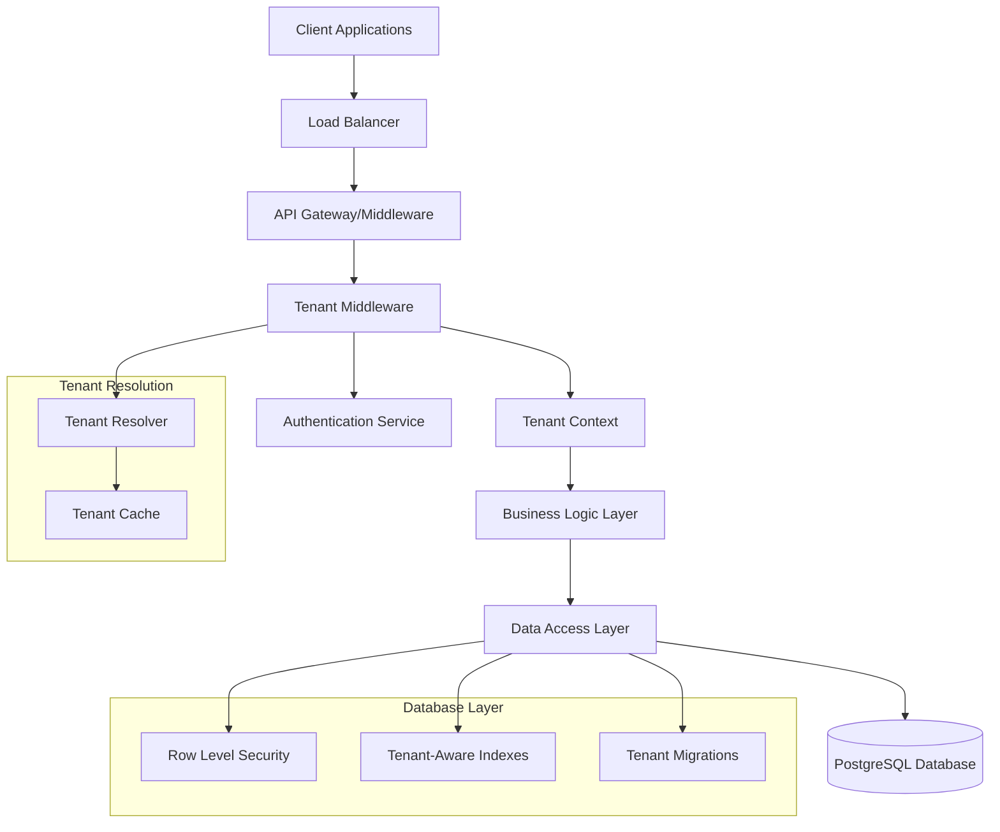

# Multi-Tenant Architecture Design Document

## Overview

This design document outlines the implementation of a multi-tenant architecture for the existing school management system. The solution will enable multiple organizations (municipalities, school districts) to use the system independently while maintaining complete data isolation, performance, and security.

The design follows a **Row-Level Security (RLS) approach** with tenant_id-based filtering, which provides the best balance of performance, maintainability, and cost-effectiveness for the current PostgreSQL-based system.

## Architecture

### High-Level Architecture



### Tenant Resolution Strategy

The system will support multiple tenant identification methods with the following priority:

1. **Subdomain-based**: `tenant1.sistema.com.br`
2. **Header-based**: `X-Tenant-ID` header
3. **Token-based**: Tenant information embedded in JWT
4. **Domain-based**: Custom domain mapping

### Database Design

#### Core Tenant Tables

```sql
-- Central tenant registry
CREATE TABLE tenants (
    id UUID PRIMARY KEY DEFAULT gen_random_uuid(),
    slug VARCHAR(50) UNIQUE NOT NULL, -- URL-friendly identifier
    name VARCHAR(255) NOT NULL,
    domain VARCHAR(255) UNIQUE, -- Custom domain if applicable
    subdomain VARCHAR(50) UNIQUE, -- Subdomain identifier
    status VARCHAR(20) DEFAULT 'active', -- active, inactive, suspended
    settings JSONB DEFAULT '{}', -- Tenant-specific configurations
    limits JSONB DEFAULT '{}', -- Resource limits and quotas
    created_at TIMESTAMP DEFAULT CURRENT_TIMESTAMP,
    updated_at TIMESTAMP DEFAULT CURRENT_TIMESTAMP
);

-- Tenant-specific configurations
CREATE TABLE tenant_configurations (
    id UUID PRIMARY KEY DEFAULT gen_random_uuid(),
    tenant_id UUID REFERENCES tenants(id) ON DELETE CASCADE,
    category VARCHAR(100) NOT NULL, -- 'features', 'limits', 'branding', etc.
    key VARCHAR(100) NOT NULL,
    value JSONB NOT NULL,
    created_at TIMESTAMP DEFAULT CURRENT_TIMESTAMP,
    updated_at TIMESTAMP DEFAULT CURRENT_TIMESTAMP,
    UNIQUE(tenant_id, category, key)
);

-- Tenant user associations
CREATE TABLE tenant_users (
    id UUID PRIMARY KEY DEFAULT gen_random_uuid(),
    tenant_id UUID REFERENCES tenants(id) ON DELETE CASCADE,
    user_id INTEGER REFERENCES usuarios(id) ON DELETE CASCADE,
    role VARCHAR(50) DEFAULT 'user', -- tenant_admin, user, viewer
    status VARCHAR(20) DEFAULT 'active',
    created_at TIMESTAMP DEFAULT CURRENT_TIMESTAMP,
    UNIQUE(tenant_id, user_id)
);
```

#### Existing Table Modifications

All existing tables will be modified to include tenant_id and implement RLS:

```sql
-- Example: Adding tenant_id to existing tables
ALTER TABLE escolas ADD COLUMN tenant_id UUID REFERENCES tenants(id);
ALTER TABLE produtos ADD COLUMN tenant_id UUID REFERENCES tenants(id);
ALTER TABLE usuarios ADD COLUMN tenant_id UUID REFERENCES tenants(id);
ALTER TABLE contratos ADD COLUMN tenant_id UUID REFERENCES tenants(id);
-- ... and so on for all multi-tenant tables

-- Create indexes for performance
CREATE INDEX idx_escolas_tenant_id ON escolas(tenant_id);
CREATE INDEX idx_produtos_tenant_id ON produtos(tenant_id);
CREATE INDEX idx_usuarios_tenant_id ON usuarios(tenant_id);
-- ... and so on

-- Enable Row Level Security
ALTER TABLE escolas ENABLE ROW LEVEL SECURITY;
ALTER TABLE produtos ENABLE ROW LEVEL SECURITY;
ALTER TABLE usuarios ENABLE ROW LEVEL SECURITY;
-- ... and so on

-- Create RLS policies
CREATE POLICY tenant_isolation_escolas ON escolas
    USING (tenant_id = current_setting('app.current_tenant_id')::UUID);

CREATE POLICY tenant_isolation_produtos ON produtos
    USING (tenant_id = current_setting('app.current_tenant_id')::UUID);
-- ... and so on for all tables
```

## Components and Interfaces

### 1. Tenant Middleware

```typescript
interface TenantMiddleware {
  // Resolve tenant from request
  resolveTenant(req: Request): Promise<Tenant | null>;
  
  // Set tenant context for request
  setTenantContext(req: Request, tenant: Tenant): void;
  
  // Validate tenant access
  validateTenantAccess(user: User, tenant: Tenant): boolean;
}

interface TenantResolver {
  // Resolve by subdomain
  resolveBySubdomain(subdomain: string): Promise<Tenant | null>;
  
  // Resolve by header
  resolveByHeader(tenantId: string): Promise<Tenant | null>;
  
  // Resolve by JWT token
  resolveByToken(token: string): Promise<Tenant | null>;
  
  // Resolve by custom domain
  resolveByDomain(domain: string): Promise<Tenant | null>;
}
```

### 2. Tenant Service

```typescript
interface TenantService {
  // Tenant management
  createTenant(data: CreateTenantInput): Promise<Tenant>;
  updateTenant(id: string, data: UpdateTenantInput): Promise<Tenant>;
  deleteTenant(id: string): Promise<void>;
  getTenant(id: string): Promise<Tenant | null>;
  listTenants(filters?: TenantFilters): Promise<Tenant[]>;
  
  // Tenant provisioning
  provisionTenant(tenant: Tenant): Promise<void>;
  deprovisionTenant(tenant: Tenant): Promise<void>;
  
  // Configuration management
  getTenantConfig(tenantId: string, category: string): Promise<any>;
  setTenantConfig(tenantId: string, category: string, config: any): Promise<void>;
}
```

### 3. Database Context Manager

```typescript
interface DatabaseContextManager {
  // Set tenant context for database session
  setTenantContext(tenantId: string): Promise<void>;
  
  // Clear tenant context
  clearTenantContext(): Promise<void>;
  
  // Execute query with tenant context
  executeWithTenant<T>(tenantId: string, query: () => Promise<T>): Promise<T>;
  
  // Validate tenant access for query
  validateTenantQuery(query: string, tenantId: string): boolean;
}
```

### 4. Migration System

```typescript
interface TenantMigrationSystem {
  // Run migrations for specific tenant
  runTenantMigrations(tenantId: string): Promise<void>;
  
  // Run migrations for all tenants
  runAllTenantMigrations(): Promise<void>;
  
  // Create tenant-specific migration
  createTenantMigration(name: string, up: string, down: string): Promise<void>;
  
  // Get migration status for tenant
  getMigrationStatus(tenantId: string): Promise<MigrationStatus[]>;
}
```

## Data Models

### Tenant Model

```typescript
interface Tenant {
  id: string;
  slug: string;
  name: string;
  domain?: string;
  subdomain?: string;
  status: 'active' | 'inactive' | 'suspended';
  settings: TenantSettings;
  limits: TenantLimits;
  createdAt: Date;
  updatedAt: Date;
}

interface TenantSettings {
  features: {
    inventory: boolean;
    contracts: boolean;
    deliveries: boolean;
    reports: boolean;
  };
  branding: {
    logo?: string;
    primaryColor?: string;
    secondaryColor?: string;
  };
  notifications: {
    email: boolean;
    sms: boolean;
    push: boolean;
  };
}

interface TenantLimits {
  maxUsers: number;
  maxSchools: number;
  maxProducts: number;
  storageLimit: number; // in MB
  apiRateLimit: number; // requests per minute
}
```

### Tenant Context

```typescript
interface TenantContext {
  tenantId: string;
  tenant: Tenant;
  user?: User;
  permissions: string[];
  settings: TenantSettings;
}
```

## Error Handling

### Tenant-Specific Error Types

```typescript
class TenantNotFoundError extends Error {
  constructor(identifier: string) {
    super(`Tenant not found: ${identifier}`);
    this.name = 'TenantNotFoundError';
  }
}

class TenantInactiveError extends Error {
  constructor(tenantId: string) {
    super(`Tenant is inactive: ${tenantId}`);
    this.name = 'TenantInactiveError';
  }
}

class CrossTenantAccessError extends Error {
  constructor(resource: string) {
    super(`Cross-tenant access denied for resource: ${resource}`);
    this.name = 'CrossTenantAccessError';
  }
}

class TenantLimitExceededError extends Error {
  constructor(limit: string, current: number, max: number) {
    super(`Tenant limit exceeded for ${limit}: ${current}/${max}`);
    this.name = 'TenantLimitExceededError';
  }
}
```

### Error Handling Strategy

1. **Graceful Degradation**: When tenant context cannot be determined, provide clear error messages
2. **Audit Logging**: Log all tenant-related errors for security monitoring
3. **Fallback Mechanisms**: Provide fallback tenant resolution methods
4. **User-Friendly Messages**: Convert technical errors to user-friendly messages

## Testing Strategy

### Unit Testing

1. **Tenant Middleware Tests**
   - Test tenant resolution from different sources
   - Test tenant context setting and validation
   - Test error handling for invalid tenants

2. **Database Context Tests**
   - Test RLS policy enforcement
   - Test tenant context injection
   - Test cross-tenant access prevention

3. **Service Layer Tests**
   - Test tenant-scoped operations
   - Test tenant configuration management
   - Test tenant provisioning workflows

### Integration Testing

1. **End-to-End Tenant Isolation**
   - Create multiple tenants with test data
   - Verify complete data isolation
   - Test API endpoints with different tenant contexts

2. **Performance Testing**
   - Test query performance with tenant filtering
   - Test system performance with multiple tenants
   - Test caching effectiveness

3. **Security Testing**
   - Test cross-tenant access prevention
   - Test tenant context tampering attempts
   - Test privilege escalation scenarios

### Migration Testing

1. **Tenant Migration Tests**
   - Test migration rollback scenarios
   - Test partial migration failures
   - Test migration consistency across tenants

2. **Data Integrity Tests**
   - Verify data consistency after migrations
   - Test foreign key constraints with tenant_id
   - Test index effectiveness

## Performance Considerations

### Database Optimization

1. **Indexing Strategy**
   ```sql
   -- Composite indexes with tenant_id first
   CREATE INDEX idx_escolas_tenant_name ON escolas(tenant_id, nome);
   CREATE INDEX idx_produtos_tenant_category ON produtos(tenant_id, categoria);
   CREATE INDEX idx_estoque_tenant_escola_produto ON estoque_escolas(tenant_id, escola_id, produto_id);
   ```

2. **Query Optimization**
   - Always include tenant_id in WHERE clauses
   - Use EXPLAIN ANALYZE to verify index usage
   - Implement query result caching per tenant

3. **Connection Management**
   - Use connection pooling with tenant context
   - Implement tenant-aware connection routing
   - Monitor connection usage per tenant

### Caching Strategy

1. **Tenant Configuration Caching**
   - Cache tenant settings and limits
   - Implement cache invalidation on updates
   - Use Redis with tenant-prefixed keys

2. **Query Result Caching**
   - Cache frequently accessed tenant data
   - Implement tenant-scoped cache keys
   - Use cache warming for active tenants

### Monitoring and Alerting

1. **Tenant-Specific Metrics**
   - Track API usage per tenant
   - Monitor database query performance per tenant
   - Alert on tenant limit violations

2. **System Health Monitoring**
   - Monitor overall system performance
   - Track tenant provisioning success rates
   - Alert on cross-tenant access attempts

## Security Considerations

### Data Isolation

1. **Database Level Security**
   - Row Level Security (RLS) policies
   - Database-level constraints
   - Audit logging for all tenant operations

2. **Application Level Security**
   - Tenant context validation in all operations
   - Input validation with tenant scope
   - API rate limiting per tenant

### Access Control

1. **Authentication**
   - Tenant-aware user authentication
   - Multi-factor authentication support
   - Session management with tenant context

2. **Authorization**
   - Role-based access control within tenants
   - Tenant administrator privileges
   - System administrator super-user access

### Audit and Compliance

1. **Audit Logging**
   - Log all tenant management operations
   - Track data access patterns per tenant
   - Maintain audit trails for compliance

2. **Data Privacy**
   - LGPD/GDPR compliance per tenant
   - Data retention policies per tenant
   - Data export and deletion capabilities

## Implementation Phases

### Phase 1: Foundation (Weeks 1-2)
- Create tenant management tables
- Implement basic tenant middleware
- Add tenant_id to core tables
- Implement tenant resolution

### Phase 2: Data Isolation (Weeks 3-4)
- Implement Row Level Security
- Update all existing queries
- Add tenant context to all controllers
- Implement migration system

### Phase 3: Advanced Features (Weeks 5-6)
- Implement tenant configuration system
- Add tenant provisioning workflows
- Implement caching and performance optimizations
- Add monitoring and alerting

### Phase 4: Testing and Deployment (Weeks 7-8)
- Comprehensive testing suite
- Performance testing and optimization
- Security testing and validation
- Production deployment and monitoring

This design provides a robust, scalable, and secure multi-tenant architecture that can be implemented incrementally while maintaining system stability and performance.