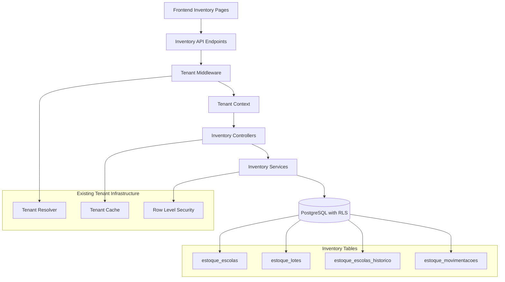
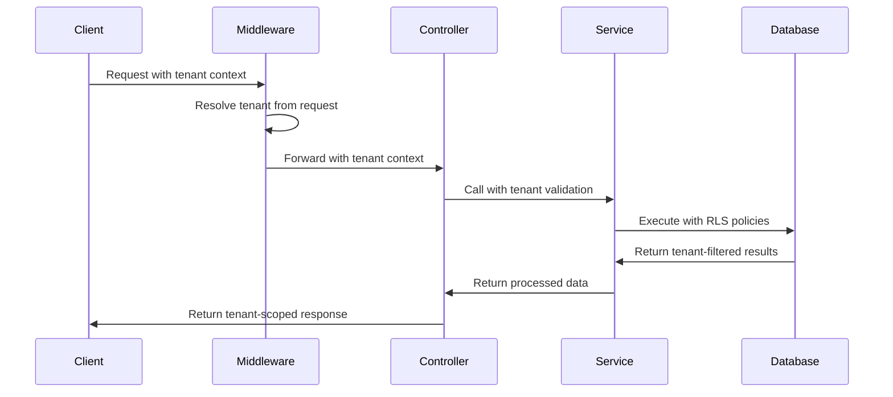

# Tenant Support for School Inventory Design Document

## Overview

This design document outlines the implementation of tenant support for the school inventory (estoque escolar) and inventory movements (movimentações de estoque) modules. The solution will leverage the existing multi-tenant architecture to provide complete data isolation while maintaining current functionality and performance.

The implementation will use the established Row-Level Security (RLS) approach with tenant context injection, building upon the existing tenant infrastructure without requiring major architectural changes.

## Architecture

### High-Level Integration



### Tenant Context Flow



## Components and Interfaces

### 1. Enhanced Inventory Controllers

The existing inventory controllers will be enhanced with tenant context support:

```typescript
// Enhanced estoqueEscolaController.ts
export async function listarEstoqueEscola(req: Request, res: Response) {
  try {
    const { escola_id } = req.params;

    // Set tenant context from request (existing middleware)
    await setTenantContextFromRequest(req);

    // Validate school belongs to current tenant
    await validateSchoolTenantOwnership(escola_id, req.tenant.id);

    // Existing query logic - RLS will automatically filter by tenant
    const result = await db.query(`
      WITH lotes_agregados AS (
        SELECT 
          el.produto_id,
          COALESCE(SUM(el.quantidade_atual), 0) as total_quantidade_lotes,
          MIN(CASE WHEN el.quantidade_atual > 0 THEN el.data_validade END) as min_validade_lotes
        FROM estoque_lotes el
        WHERE el.status = 'ativo'
          AND el.escola_id = $1
        GROUP BY el.produto_id
      )
      SELECT 
        ee.id,
        $1::integer as escola_id,
        p.id as produto_id,
        -- ... existing query logic
      FROM produtos p
      CROSS JOIN escolas e
      LEFT JOIN estoque_escolas ee ON (ee.produto_id = p.id AND ee.escola_id = e.id)
      LEFT JOIN lotes_agregados la ON la.produto_id = p.id
      WHERE p.ativo = true 
        AND e.id = $1 
        AND e.ativo = true
      ORDER BY -- ... existing ordering
    `, [escola_id]);

    // Response remains the same
    res.json({
      success: true,
      data: result.rows,
      total: result.rows.length
    });
  } catch (error) {
    // Enhanced error handling with tenant context
    handleTenantInventoryError(error, res);
  }
}
```

### 2. Tenant Validation Services

New validation services to ensure tenant ownership:

```typescript
interface TenantInventoryValidator {
  validateSchoolTenantOwnership(schoolId: number, tenantId: string): Promise<void>;
  validateProductTenantOwnership(productId: number, tenantId: string): Promise<void>;
  validateInventoryItemTenantOwnership(itemId: number, tenantId: string): Promise<void>;
  validateBulkTenantOwnership(entityType: string, entityIds: number[], tenantId: string): Promise<void>;
}

class DatabaseTenantInventoryValidator implements TenantInventoryValidator {
  async validateSchoolTenantOwnership(schoolId: number, tenantId: string): Promise<void> {
    const result = await db.query(`
      SELECT id FROM escolas 
      WHERE id = $1 AND tenant_id = $2 AND ativo = true
    `, [schoolId, tenantId]);
    
    if (result.rows.length === 0) {
      throw new TenantOwnershipError('School', schoolId, tenantId);
    }
  }

  async validateProductTenantOwnership(productId: number, tenantId: string): Promise<void> {
    const result = await db.query(`
      SELECT id FROM produtos 
      WHERE id = $1 AND tenant_id = $2 AND ativo = true
    `, [productId, tenantId]);
    
    if (result.rows.length === 0) {
      throw new TenantOwnershipError('Product', productId, tenantId);
    }
  }

  // ... other validation methods
}
```

### 3. Enhanced Frontend Integration

Frontend pages will be enhanced to work with tenant context:

```typescript
// Enhanced EstoqueEscolar.tsx
const EstoqueEscolarPage = () => {
  // Existing state management
  const [searchTerm, setSearchTerm] = useState("");
  const [selectedStatus, setSelectedStatus] = useState("");
  // ... other states

  // Enhanced React Query hooks with tenant context
  const estoqueQuery = useEstoqueEscolarResumo({
    tenantId: currentTenant?.id, // Automatically included
    enabled: !!currentTenant?.id
  });

  const matrizQuery = useMatrizEstoque(
    selectedProdutos.length > 0 ? selectedProdutos : undefined, 
    50,
    {
      tenantId: currentTenant?.id,
      enabled: !!currentTenant?.id
    }
  );

  // Enhanced error handling for tenant-specific errors
  const handleTenantError = useCallback((error: any) => {
    if (error.code === 'TENANT_OWNERSHIP_ERROR') {
      setError('Você não tem permissão para acessar este recurso.');
    } else if (error.code === 'TENANT_CONTEXT_MISSING') {
      setError('Contexto de organização não encontrado. Faça login novamente.');
    } else {
      setError(error.message || 'Erro desconhecido');
    }
  }, []);

  // Rest of component logic remains the same
  // RLS and backend validation handle tenant filtering automatically
};
```

### 4. Database Schema Enhancements

The existing inventory tables will be enhanced with tenant support:

```sql
-- Add tenant_id to inventory tables (if not already present)
ALTER TABLE estoque_escolas ADD COLUMN IF NOT EXISTS tenant_id UUID REFERENCES tenants(id);
ALTER TABLE estoque_lotes ADD COLUMN IF NOT EXISTS tenant_id UUID REFERENCES tenants(id);
ALTER TABLE estoque_escolas_historico ADD COLUMN IF NOT EXISTS tenant_id UUID REFERENCES tenants(id);

-- Create tenant-aware indexes for performance
CREATE INDEX IF NOT EXISTS idx_estoque_escolas_tenant_escola 
ON estoque_escolas(tenant_id, escola_id);

CREATE INDEX IF NOT EXISTS idx_estoque_escolas_tenant_produto 
ON estoque_escolas(tenant_id, produto_id);

CREATE INDEX IF NOT EXISTS idx_estoque_lotes_tenant_produto 
ON estoque_lotes(tenant_id, produto_id);

CREATE INDEX IF NOT EXISTS idx_estoque_lotes_tenant_escola_produto 
ON estoque_lotes(tenant_id, escola_id, produto_id);

CREATE INDEX IF NOT EXISTS idx_estoque_historico_tenant_escola 
ON estoque_escolas_historico(tenant_id, escola_id);

-- Enable RLS on inventory tables
ALTER TABLE estoque_escolas ENABLE ROW LEVEL SECURITY;
ALTER TABLE estoque_lotes ENABLE ROW LEVEL SECURITY;
ALTER TABLE estoque_escolas_historico ENABLE ROW LEVEL SECURITY;

-- Create RLS policies for inventory tables
CREATE POLICY tenant_isolation_estoque_escolas ON estoque_escolas
    USING (tenant_id = get_current_tenant_id());

CREATE POLICY tenant_isolation_estoque_lotes ON estoque_lotes
    USING (tenant_id = get_current_tenant_id());

CREATE POLICY tenant_isolation_estoque_historico ON estoque_escolas_historico
    USING (tenant_id = get_current_tenant_id());

-- Create triggers to automatically set tenant_id on insert
CREATE OR REPLACE FUNCTION set_tenant_id_on_inventory()
RETURNS TRIGGER AS $$
BEGIN
    NEW.tenant_id = get_current_tenant_id();
    RETURN NEW;
END;
$$ LANGUAGE plpgsql;

CREATE TRIGGER trigger_set_tenant_id_estoque_escolas
    BEFORE INSERT ON estoque_escolas
    FOR EACH ROW EXECUTE FUNCTION set_tenant_id_on_inventory();

CREATE TRIGGER trigger_set_tenant_id_estoque_lotes
    BEFORE INSERT ON estoque_lotes
    FOR EACH ROW EXECUTE FUNCTION set_tenant_id_on_inventory();

CREATE TRIGGER trigger_set_tenant_id_estoque_historico
    BEFORE INSERT ON estoque_escolas_historico
    FOR EACH ROW EXECUTE FUNCTION set_tenant_id_on_inventory();
```

## Data Models

### Enhanced Inventory Models

```typescript
// Enhanced inventory interfaces with tenant context
interface EstoqueEscolarItem {
  id: number;
  escola_id: number;
  produto_id: number;
  quantidade_atual: number;
  data_validade?: string;
  data_entrada?: string;
  data_ultima_atualizacao: string;
  produto_nome: string;
  produto_descricao?: string;
  unidade_medida: string;
  categoria: string;
  escola_nome: string;
  status_estoque: 'normal' | 'critico' | 'vencido' | 'atencao' | 'sem_estoque';
  dias_para_vencimento?: number;
  tenant_id: string; // Added for explicit tenant tracking
  lotes?: EstoqueLote[]; // Enhanced with tenant-aware lotes
}

interface EstoqueLote {
  id: number;
  produto_id: number;
  escola_id: number;
  lote: string;
  quantidade_inicial: number;
  quantidade_atual: number;
  data_validade?: string;
  data_fabricacao?: string;
  status: 'ativo' | 'esgotado' | 'vencido';
  observacoes?: string;
  tenant_id: string; // Added for explicit tenant tracking
  created_at: string;
  updated_at: string;
}

interface MovimentacaoEstoque {
  id: number;
  estoque_escola_id: number;
  escola_id: number;
  produto_id: number;
  tipo_movimentacao: 'entrada' | 'saida' | 'ajuste';
  quantidade_anterior: number;
  quantidade_movimentada: number;
  quantidade_posterior: number;
  motivo?: string;
  documento_referencia?: string;
  usuario_id?: number;
  tenant_id: string; // Added for explicit tenant tracking
  data_movimentacao: string;
}
```

### Tenant Context Integration

```typescript
interface TenantInventoryContext {
  tenantId: string;
  tenant: Tenant;
  user?: User;
  permissions: InventoryPermission[];
  settings: TenantInventorySettings;
}

interface TenantInventorySettings {
  features: {
    batchTracking: boolean;
    expirationAlerts: boolean;
    automaticReorder: boolean;
    crossSchoolTransfers: boolean;
  };
  limits: {
    maxProductsPerSchool: number;
    maxBatchesPerProduct: number;
    maxMovementsPerDay: number;
  };
  notifications: {
    lowStockThreshold: number;
    expirationWarningDays: number;
    criticalStockThreshold: number;
  };
}

type InventoryPermission = 
  | 'inventory.view'
  | 'inventory.create'
  | 'inventory.update'
  | 'inventory.delete'
  | 'inventory.movements.create'
  | 'inventory.movements.view'
  | 'inventory.reports.view'
  | 'inventory.admin';
```

## Error Handling

### Tenant-Specific Inventory Errors

```typescript
class TenantOwnershipError extends Error {
  constructor(entityType: string, entityId: number, tenantId: string) {
    super(`${entityType} ${entityId} does not belong to tenant ${tenantId}`);
    this.name = 'TenantOwnershipError';
    this.code = 'TENANT_OWNERSHIP_ERROR';
  }
}

class TenantInventoryLimitError extends Error {
  constructor(limit: string, current: number, max: number, tenantId: string) {
    super(`Tenant ${tenantId} inventory limit exceeded for ${limit}: ${current}/${max}`);
    this.name = 'TenantInventoryLimitError';
    this.code = 'TENANT_INVENTORY_LIMIT_ERROR';
  }
}

class CrossTenantInventoryAccessError extends Error {
  constructor(operation: string, resourceId: number) {
    super(`Cross-tenant inventory access denied for ${operation} on resource ${resourceId}`);
    this.name = 'CrossTenantInventoryAccessError';
    this.code = 'CROSS_TENANT_INVENTORY_ACCESS';
  }
}

// Enhanced error handler for inventory operations
function handleTenantInventoryError(error: any, res: Response) {
  console.error("❌ Tenant inventory error:", error);
  
  if (error instanceof TenantOwnershipError) {
    return res.status(403).json({
      success: false,
      message: "Acesso negado: recurso não pertence à sua organização",
      code: error.code
    });
  }
  
  if (error instanceof TenantInventoryLimitError) {
    return res.status(429).json({
      success: false,
      message: "Limite de inventário da organização excedido",
      code: error.code,
      details: error.message
    });
  }
  
  if (error instanceof CrossTenantInventoryAccessError) {
    return res.status(403).json({
      success: false,
      message: "Acesso negado: operação entre organizações não permitida",
      code: error.code
    });
  }
  
  // Default error handling
  res.status(500).json({
    success: false,
    message: "Erro interno do servidor",
    error: process.env.NODE_ENV === 'development' ? error.message : 'Erro desconhecido'
  });
}
```

## Testing Strategy

### Unit Testing

1. **Tenant Validation Tests**
   ```typescript
   describe('TenantInventoryValidator', () => {
     it('should validate school ownership for correct tenant', async () => {
       const validator = new DatabaseTenantInventoryValidator();
       await expect(validator.validateSchoolTenantOwnership(1, 'tenant-1'))
         .resolves.not.toThrow();
     });

     it('should reject school access for wrong tenant', async () => {
       const validator = new DatabaseTenantInventoryValidator();
       await expect(validator.validateSchoolTenantOwnership(1, 'tenant-2'))
         .rejects.toThrow(TenantOwnershipError);
     });
   });
   ```

2. **Controller Integration Tests**
   ```typescript
   describe('Inventory Controllers with Tenant Context', () => {
     it('should return only tenant-scoped inventory data', async () => {
       const req = mockRequestWithTenant('tenant-1');
       const res = mockResponse();
       
       await listarEstoqueEscola(req, res);
       
       expect(res.json).toHaveBeenCalledWith(
         expect.objectContaining({
           success: true,
           data: expect.arrayContaining([
             expect.objectContaining({ tenant_id: 'tenant-1' })
           ])
         })
       );
     });
   });
   ```

### Integration Testing

1. **End-to-End Tenant Isolation**
   ```typescript
   describe('Inventory Tenant Isolation E2E', () => {
     it('should completely isolate inventory data between tenants', async () => {
       // Create test data for multiple tenants
       await createTestInventoryData('tenant-1', 'tenant-2');
       
       // Test tenant-1 access
       const tenant1Response = await request(app)
         .get('/api/estoque-escola/escola/1')
         .set('X-Tenant-ID', 'tenant-1');
       
       // Test tenant-2 access
       const tenant2Response = await request(app)
         .get('/api/estoque-escola/escola/1')
         .set('X-Tenant-ID', 'tenant-2');
       
       // Verify complete isolation
       expect(tenant1Response.body.data).not.toEqual(tenant2Response.body.data);
     });
   });
   ```

### Performance Testing

1. **Tenant-Scoped Query Performance**
   ```typescript
   describe('Inventory Query Performance with Tenants', () => {
     it('should maintain acceptable performance with tenant filtering', async () => {
       const startTime = Date.now();
       
       await request(app)
         .get('/api/estoque-escola/resumo')
         .set('X-Tenant-ID', 'tenant-1');
       
       const endTime = Date.now();
       expect(endTime - startTime).toBeLessThan(1000); // 1 second max
     });
   });
   ```

## Performance Considerations

### Database Optimization

1. **Optimized Indexes**
   ```sql
   -- Composite indexes with tenant_id first for optimal filtering
   CREATE INDEX idx_estoque_tenant_escola_produto 
   ON estoque_escolas(tenant_id, escola_id, produto_id);
   
   CREATE INDEX idx_estoque_tenant_status 
   ON estoque_escolas(tenant_id, quantidade_atual) 
   WHERE quantidade_atual > 0;
   
   CREATE INDEX idx_lotes_tenant_validade 
   ON estoque_lotes(tenant_id, data_validade) 
   WHERE status = 'ativo' AND data_validade IS NOT NULL;
   ```

2. **Query Optimization**
   - Always include tenant_id in WHERE clauses (handled by RLS)
   - Use EXPLAIN ANALYZE to verify index usage
   - Implement query result caching per tenant

### Caching Strategy

1. **Tenant-Aware Caching**
   ```typescript
   class TenantInventoryCache {
     private cache = new Map<string, any>();
     
     getCacheKey(tenantId: string, operation: string, params: any): string {
       return `inventory:${tenantId}:${operation}:${JSON.stringify(params)}`;
     }
     
     async get(tenantId: string, operation: string, params: any): Promise<any> {
       const key = this.getCacheKey(tenantId, operation, params);
       return this.cache.get(key);
     }
     
     async set(tenantId: string, operation: string, params: any, data: any, ttl: number = 300): Promise<void> {
       const key = this.getCacheKey(tenantId, operation, params);
       this.cache.set(key, data);
       
       // Set TTL
       setTimeout(() => {
         this.cache.delete(key);
       }, ttl * 1000);
     }
   }
   ```

## Security Considerations

### Data Isolation

1. **Database-Level Security**
   - RLS policies automatically filter by tenant_id
   - Database triggers ensure tenant_id is always set
   - Foreign key constraints maintain referential integrity within tenants

2. **Application-Level Security**
   - Explicit tenant validation in all controllers
   - Input validation with tenant scope
   - API rate limiting per tenant

### Access Control

1. **Inventory-Specific Permissions**
   ```typescript
   const inventoryPermissions = {
     'inventory.view': 'View inventory data',
     'inventory.create': 'Create inventory records',
     'inventory.update': 'Update inventory quantities',
     'inventory.delete': 'Delete inventory records',
     'inventory.movements.create': 'Create inventory movements',
     'inventory.movements.view': 'View movement history',
     'inventory.reports.view': 'View inventory reports',
     'inventory.admin': 'Full inventory administration'
   };
   ```

## Implementation Phases

### Phase 1: Database Schema Enhancement (Week 1)
- Add tenant_id columns to inventory tables
- Create tenant-aware indexes
- Implement RLS policies and triggers
- Create data migration scripts

### Phase 2: Backend Integration (Week 2)
- Enhance inventory controllers with tenant context
- Implement tenant validation services
- Update inventory services for tenant filtering
- Add comprehensive error handling

### Phase 3: Frontend Integration (Week 3)
- Update React Query hooks for tenant context
- Enhance inventory pages with tenant awareness
- Implement tenant-specific error handling
- Update inventory components for tenant isolation

### Phase 4: Testing and Optimization (Week 4)
- Comprehensive testing suite implementation
- Performance testing and optimization
- Security testing and validation
- Documentation and deployment preparation

This design provides a robust, secure, and performant implementation of tenant support for the school inventory system, leveraging existing infrastructure while ensuring complete data isolation and maintaining system performance.