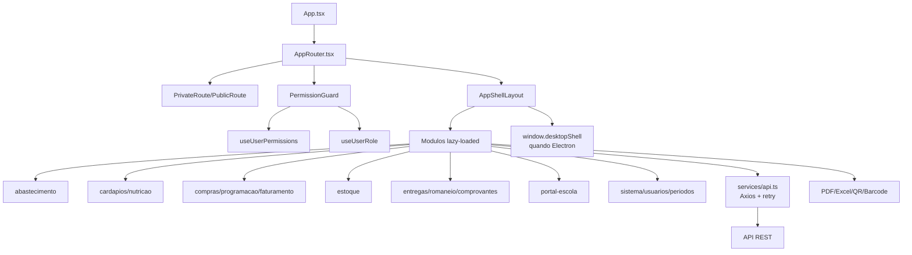
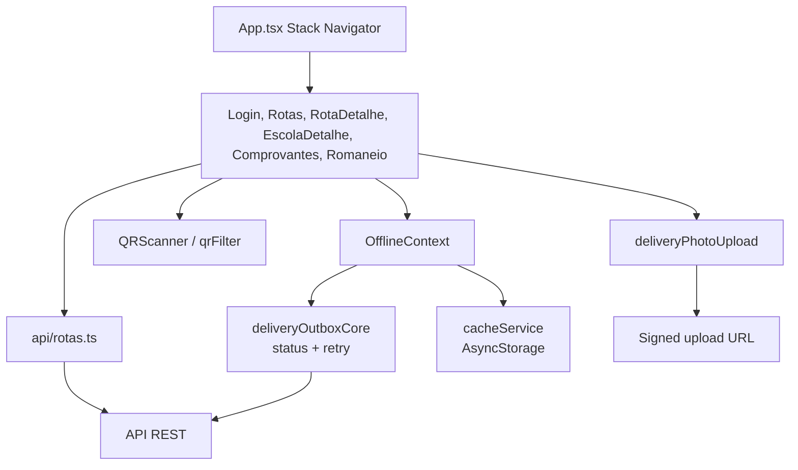
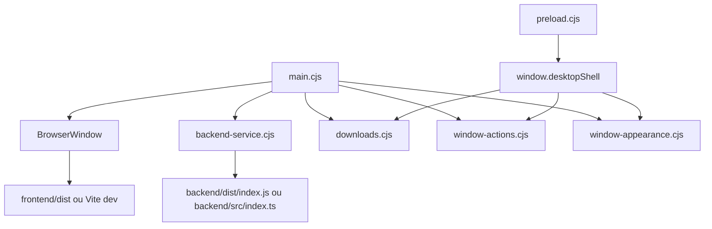

# C4 Componentes - gestaoescolar

## API Express

```mermaid
flowchart TB
  Router["registerApiRoutes.ts"] --> Auth["authMiddleware\nJWT"]
  Router --> Perm["permissionMiddleware\nRBAC 0..3"]
  Router --> Usuarios["usuarios/admin"]
  Router --> Sistema["sistema\npermissoes, periodos, calendario, notificacoes, realtime"]
  Router --> Escolas["escolas / portal"]
  Router --> Nutricao["cardapios, refeicoes, nutricionistas, TACO"]
  Router --> Produtos["produtos, unidades, produto-modalidades"]
  Router --> Contratos["fornecedores, contratos, saldos"]
  Router --> Guias["guias, demandas, geracao async"]
  Router --> Compras["compras, planejamento, programacoes"]
  Router --> Estoque["estoque central/escolar, ledger, lotes"]
  Router --> Entregas["entregas, rotas, comprovantes, fotos"]
  Router --> Recebimentos["recebimentos"]
  Router --> Faturamentos["faturamentos"]

  Usuarios --> DB["db.query / transaction"]
  Sistema --> DB
  Escolas --> DB
  Nutricao --> DB
  Produtos --> DB
  Contratos --> DB
  Guias --> DB
  Compras --> DB
  Estoque --> DB
  Entregas --> DB
  Recebimentos --> DB
  Faturamentos --> DB
  Entregas --> Storage["photo storage / signed upload"]
  Sistema --> Events["realtimeEvents"]
```

## Frontend React

## App Entregador

## Desktop

## Duvidas tecnicas

- LACUNA: rotas de alguns modulos usam slugs diferentes entre frontend/backend.
- LACUNA: `shared` nao esta conectado ativamente aos containers.
- LACUNA: apps mobile misturam Axios/fetch e URLs fixas.
- LACUNA: cobertura de testes e irregular entre modulos criticos.
