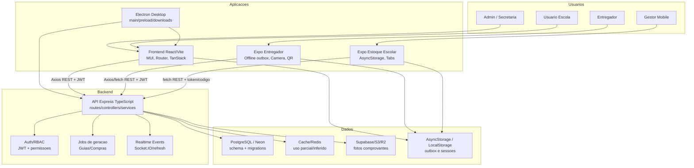

# C4 Containers - gestaoescolar

## Containers confirmados

| Container | Porta/URL conhecida | Observacao |
| --- | --- | --- |
| Frontend dev | `127.0.0.1:5173` no desktop dev | Vite |
| Backend dev | `localhost:3000` fallback | Express |
| Backend desktop | `127.0.0.1:3131` padrao | Electron empacotado |
| Backend producao mobile | `https://gestaoescolar-backend.vercel.app` em apps | URL hardcoded em partes |
| Banco | `DATABASE_URL`/`POSTGRES_URL`/`NEON_DATABASE_URL` | SSL remoto verify-full |
