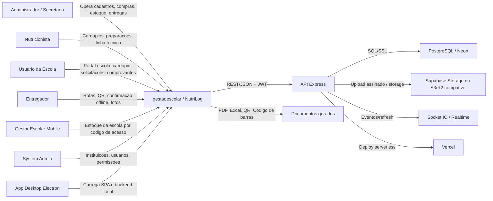

# C4 Contexto - gestaoescolar

## Notas

- CONFIRMADO: usuarios e sistemas foram extraidos de inventario, rotas, apps mobile e Detective.
- CONFIRMADO: comunicacao principal e REST/JSON com JWT.
- INFERIDO: Storage pode ser Supabase ou S3/R2 compativel conforme codigo e historico Git.
