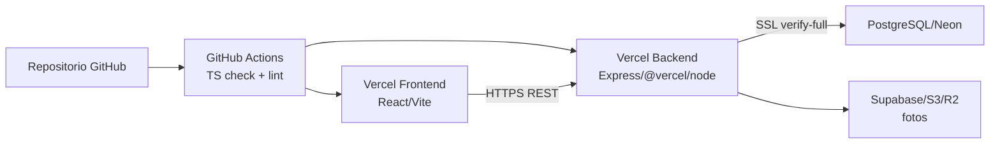
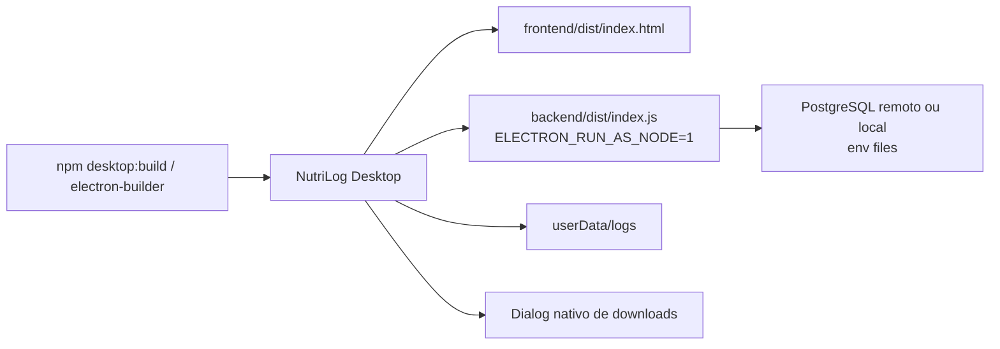
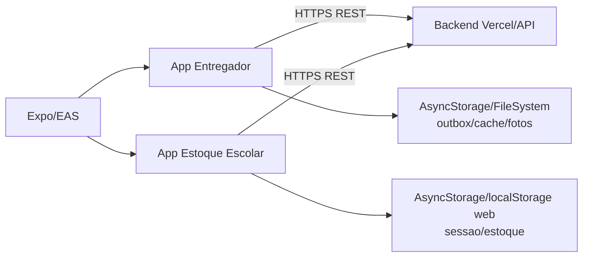

# Deployment e Infraestrutura - gestaoescolar

Gerado pelo Reversa Architect em 2026-04-29.

## Topologias suportadas

### Web/Cloud

CONFIRMADO: inventario encontrou GitHub Actions, `frontend/vercel.json`, `backend/vercel.json`, scripts/docs Vercel e historico de fixes de deploy.

### Desktop

CONFIRMADO: `desktop/backend-service.cjs` inicia backend local empacotado e le `nutrilog.env` ao lado do executavel ou em `userData`.

### Mobile

CONFIRMADO: apps usam Expo; `estoque-escolar-mobile` contem `eas.json`; URLs de producao aparecem hardcoded em fluxos mobile.

## Variaveis e configuracoes relevantes

| Area | Variaveis/arquivos | Observacao |
| --- | --- | --- |
| Banco | `NEON_DATABASE_URL`, `POSTGRES_URL`, `DATABASE_URL`, `DB_*` | Prioridade connection string; local se localhost |
| Auth | `JWT_SECRET` | Health check falha se ausente; historico mostra incidentes Vercel |
| Desktop | `DESKTOP_BACKEND_PORT`, `DESKTOP_API_BASE_URL`, `DESKTOP_HEALTH_URL`, `ELECTRON_FORCE_PACKAGED` | Porta padrao 3131 |
| Frontend | `VITE_API_URL`, `VITE_HEALTH_URL`, `VITE_VERCEL` | Resolve base URL e health |
| Mobile | URLs em config/API | Parte hardcoded para `gestaoescolar-backend.vercel.app` |

## Artefatos de build

- Raiz: scripts `desktop:dev`, `desktop:build`, `desktop:pack`, `desktop:dist`.
- Backend: `tsc`, `tsx src/index.ts`, `@vercel/node`.
- Frontend: Vite build e modo `build:desktop`.
- Mobile: Expo start/run; EAS no app estoque escolar.

## Riscos de deployment

- LACUNA: nao foram encontrados Dockerfile/docker-compose no inventario util.
- CONFIRMADO: houve historico recorrente de problemas de MIME/rewrite no Vercel.
- CONFIRMADO: workspaces/hoisting exigiram ajustes de `NODE_PATH` e aliases.
- CONFIRMADO: desktop pode renderizar antes de backend local estar pronto.
- LACUNA: endpoints de debug/env precisam ser auditados antes de producao.
