# ERD Completo - gestaoescolar

Gerado pelo Reversa Architect em nivel de dominio. A validacao de DDL, constraints e triggers deve ser feita pelo Reversa Data Master.

```mermaid
erDiagram
  INSTITUICOES ||--o{ USUARIOS : possui
  INSTITUICOES ||--o{ ESCOLAS : administra
  USUARIOS }o--|| FUNCOES : possui
  FUNCOES ||--o{ FUNCAO_PERMISSOES : define
  USUARIOS ||--o{ USUARIO_PERMISSOES : sobrescreve
  MODULOS ||--o{ FUNCAO_PERMISSOES : controla
  MODULOS ||--o{ USUARIO_PERMISSOES : controla
  NIVEIS_PERMISSAO ||--o{ FUNCAO_PERMISSOES : nivel
  NIVEIS_PERMISSAO ||--o{ USUARIO_PERMISSOES : nivel

  ESCOLAS ||--o{ ESCOLA_MODALIDADES : atende
  ESCOLAS ||--o{ ESCOLA_MODALIDADES_HISTORICO : historico
  MODALIDADES ||--o{ ESCOLA_MODALIDADES : classifica
  MODALIDADES ||--o{ ESCOLA_MODALIDADES_HISTORICO : historico
  CATEGORIAS_FINANCEIRAS_MODALIDADE ||--o{ MODALIDADES : categoriza

  MODALIDADES }o--o{ CARDAPIOS_MODALIDADE : vincula
  CARDAPIOS_MODALIDADE ||--o{ CARDAPIO_REFEICOES_DIA : agenda
  REFEICOES ||--o{ CARDAPIO_REFEICOES_DIA : compoe
  REFEICOES ||--o{ REFEICAO_PRODUTOS : usa
  PRODUTOS ||--o{ REFEICAO_PRODUTOS : ingrediente
  REFEICAO_PRODUTOS ||--o{ REFEICAO_PRODUTO_MODALIDADE : ajusta
  UNIDADES_MEDIDA ||--o{ PRODUTOS : mede

  FORNECEDORES ||--o{ CONTRATOS : assina
  CONTRATOS ||--o{ CONTRATO_PRODUTOS : precifica
  PRODUTOS ||--o{ CONTRATO_PRODUTOS : contratado
  MODALIDADES ||--o{ SALDO_CONTRATOS_MODALIDADES : consome
  CONTRATOS ||--o{ SALDO_CONTRATOS_MODALIDADES : limita

  GUIAS ||--o{ GUIA_ITENS : contem
  ESCOLAS ||--o{ GUIA_ITENS : destino
  PRODUTOS ||--o{ GUIA_ITENS : solicitado
  CARDAPIOS_MODALIDADE ||--o{ GUIAS : origem
  GUIAS ||--o{ PEDIDOS : gera
  PEDIDOS ||--o{ PEDIDO_ITENS : contem
  CONTRATO_PRODUTOS ||--o{ PEDIDO_ITENS : precifica
  PEDIDO_ITENS ||--o{ PROGRAMACOES_ENTREGA : programa
  ESCOLAS ||--o{ PROGRAMACOES_ENTREGA : recebe

  PEDIDOS ||--o{ RECEBIMENTOS : recebe
  PEDIDO_ITENS ||--o{ RECEBIMENTOS : item
  FORNECEDORES ||--o{ RECEBIMENTOS : entrega

  PRODUTOS ||--o{ ESTOQUE_CENTRAL : saldo
  PRODUTOS ||--o{ ESTOQUE_LOTES : lote
  ESCOLAS ||--o{ ESTOQUE_ESCOLA : saldo
  PRODUTOS ||--o{ ESTOQUE_ESCOLA : saldo
  ESTOQUE_LOTES ||--o{ MOVIMENTACOES_ESTOQUE : movimenta
  ESTOQUE_ESCOLA ||--o{ MOVIMENTACOES_ESTOQUE : movimenta
  PRODUTOS ||--o{ ESTOQUE_EVENTOS : evento
  ESCOLAS ||--o{ ESTOQUE_EVENTOS : escopo

  ROTAS ||--o{ ROTA_ESCOLAS : ordena
  ESCOLAS ||--o{ ROTA_ESCOLAS : pertence
  ROTAS ||--o{ PLANEJAMENTOS_ROTA : planeja
  GUIAS ||--o{ PLANEJAMENTOS_ROTA : origem

  GUIA_ITENS ||--o{ HISTORICO_ENTREGAS : entrega
  ESCOLAS ||--o{ COMPROVANTES_ENTREGA : recebe
  COMPROVANTES_ENTREGA ||--o{ COMPROVANTE_ITENS : detalha
  HISTORICO_ENTREGAS ||--o{ COMPROVANTE_ITENS : comprova
  COMPROVANTES_ENTREGA ||--o{ COMPROVANTE_FOTOS : evidencia

  PEDIDOS ||--o{ FATURAMENTOS : fatura
  FATURAMENTOS ||--o{ FATURAMENTO_ITENS : detalha
  MODALIDADES ||--o{ FATURAMENTO_ITENS : rateia

  ESCOLAS ||--o{ SOLICITACOES_ALIMENTOS : solicita
  USUARIOS ||--o{ SOLICITACOES_ALIMENTOS : responde
  USUARIOS ||--o{ NOTIFICACOES : recebe
  ESCOLAS ||--o{ EVENTOS_CALENDARIO : calendario
```

## Entidades principais e atributos

| Entidade | Atributos principais | Confianca |
| --- | --- | --- |
| `instituicoes` | id, nome, ativo, settings/limites inferidos | CONFIRMADO/INFERIDO |
| `usuarios` | id, nome, email, tipo, escola_id, funcao_id, ativo, isSystemAdmin | CONFIRMADO |
| `funcoes` | id, nome, ativo | CONFIRMADO |
| `modulos` | id, slug, nome | CONFIRMADO |
| `niveis_permissao` | id, nivel, nome | CONFIRMADO |
| `escolas` | id, nome, codigo/INEP, endereco, gestor, ativo | CONFIRMADO |
| `modalidades` | id, nome, categoria_financeira_id, valor_repasse, ativo | CONFIRMADO |
| `cardapios_modalidade` | id, nome, mes, ano, ativo, periodo_id | CONFIRMADO |
| `refeicoes` | id, nome, categoria, modo_preparo, nutrientes, ativo | CONFIRMADO |
| `produtos` | id, nome, unidade, categoria, perecivel, ativo | CONFIRMADO |
| `contratos` | id, numero, fornecedor_id, datas, valor_total, status, ativo | CONFIRMADO |
| `pedidos` | id, numero, status, valor_total, guia_id, competencia | CONFIRMADO |
| `guias` | id, mes, ano, status, periodo/cardapio origem | CONFIRMADO |
| `estoque_eventos` | id, escopo, produto_id, escola_id, tipo_evento, origem, delta | CONFIRMADO |
| `comprovantes_entrega` | id, numero, escola_id, recebedor, entregador, status, data | CONFIRMADO |
| `comprovante_fotos` | id, comprovante_id, storage_key/url, content_type, size | CONFIRMADO |
| `faturamentos` | id, pedido_id, status, valores/resumo | CONFIRMADO |
| `solicitacoes_alimentos` | id, escola_id, status, itens/resposta | CONFIRMADO |

## Lacunas ERD

- LACUNA: cardinalidades e nomes exatos de tabelas de algumas entidades foram sintetizados a partir de modelos/controllers e precisam de confirmacao por DDL.
- LACUNA: ha tabelas historicas e migrations `.bak`; Data Master deve separar schema ativo de legado.
