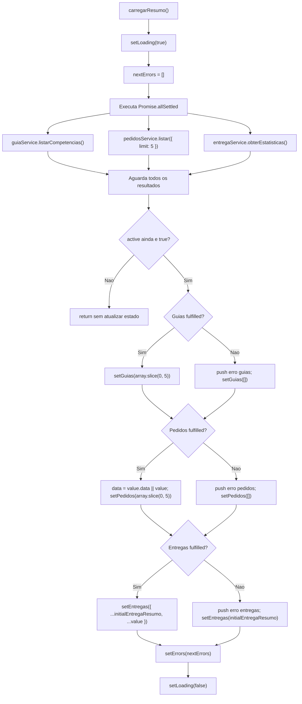

# Fluxograma por Funcao - abastecimento/carregarResumo

Funcao interna em `frontend/src/modules/abastecimento/pages/Abastecimento.tsx`.

```mermaid
flowchart TD
  A["carregarResumo()"] --> B["setLoading(true)"]
  B --> C["nextErrors = []"]
  C --> D["Executa Promise.allSettled"]
  D --> D1["guiaService.listarCompetencias()"]
  D --> D2["pedidosService.listar({ limit: 5 })"]
  D --> D3["entregaService.obterEstatisticas()"]
  D1 --> E["Aguarda todos os resultados"]
  D2 --> E
  D3 --> E
  E --> F{"active ainda e true?"}
  F -- "Nao" --> G["return sem atualizar estado"]
  F -- "Sim" --> H{"Guias fulfilled?"}
  H -- "Sim" --> I["setGuias(array.slice(0, 5))"]
  H -- "Nao" --> J["push erro guias; setGuias([])"]
  I --> K{"Pedidos fulfilled?"}
  J --> K
  K -- "Sim" --> L["data = value.data || value; setPedidos(array.slice(0, 5))"]
  K -- "Nao" --> M["push erro pedidos; setPedidos([])"]
  L --> N{"Entregas fulfilled?"}
  M --> N
  N -- "Sim" --> O["setEntregas({ ...initialEntregaResumo, ...value })"]
  N -- "Nao" --> P["push erro entregas; setEntregas(initialEntregaResumo)"]
  O --> Q["setErrors(nextErrors)"]
  P --> Q
  Q --> R["setLoading(false)"]
```
