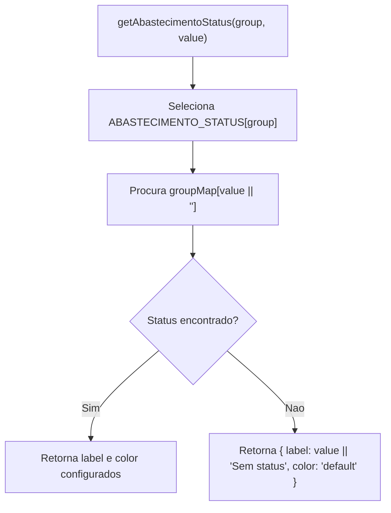

# Fluxograma por Funcao - abastecimento/getAbastecimentoStatus

Funcao em `frontend/src/modules/abastecimento/status.ts`.

```mermaid
flowchart TD
  A["getAbastecimentoStatus(group, value)"] --> B["Seleciona ABASTECIMENTO_STATUS[group]"]
  B --> C["Procura groupMap[value || '']"]
  C --> D{"Status encontrado?"}
  D -- "Sim" --> E["Retorna label e color configurados"]
  D -- "Nao" --> F["Retorna { label: value || 'Sem status', color: 'default' }"]
```
