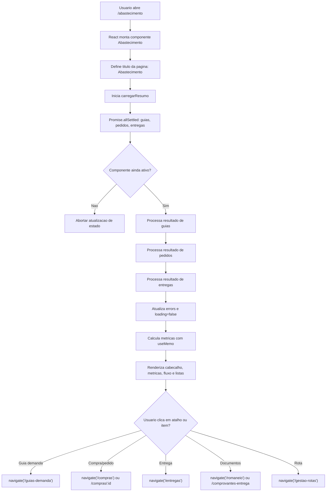

# Fluxograma - Modulo abastecimento

Confianca: CONFIRMADO, exceto onde indicado.

## Observacoes

- A pagina nao persiste dados diretamente.
- A pagina tolera falhas parciais de API.
- A ordem operacional exibida e guia -> compra -> entrega -> documentos.
