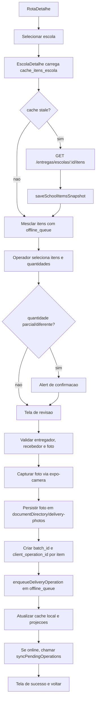

# Fluxo: App Entregador - confirmacao de entrega

## Evidencias

- `apps/entregador-native/src/screens/EscolaDetalheScreen.tsx`
- `apps/entregador-native/src/services/deliveryOutbox.ts`
- `apps/entregador-native/src/services/deliveryOutboxCore.ts`
- `apps/entregador-native/src/services/deliveryPhotoLocalFile.ts`
- `apps/entregador-native/src/services/deliveryPhotoReview.ts`
