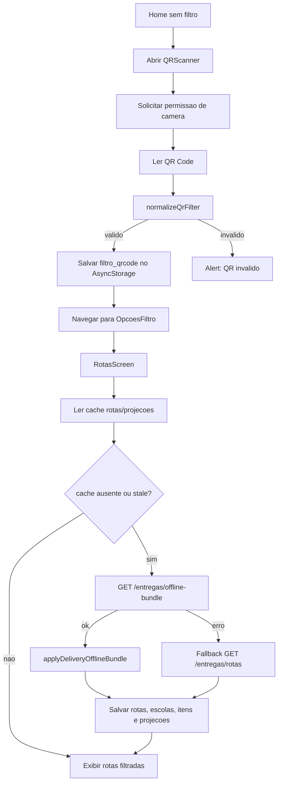

# Fluxo: App Entregador - QR, cache e offline

## Evidencias

- `apps/entregador-native/src/components/QRScanner.tsx`
- `apps/entregador-native/src/utils/qrFilter.ts`
- `apps/entregador-native/src/screens/HomeScreen.tsx`
- `apps/entregador-native/src/screens/RotasScreen.tsx`
- `apps/entregador-native/src/services/deliveryOfflineBundle.ts`
- `apps/entregador-native/src/services/cacheService.ts`
