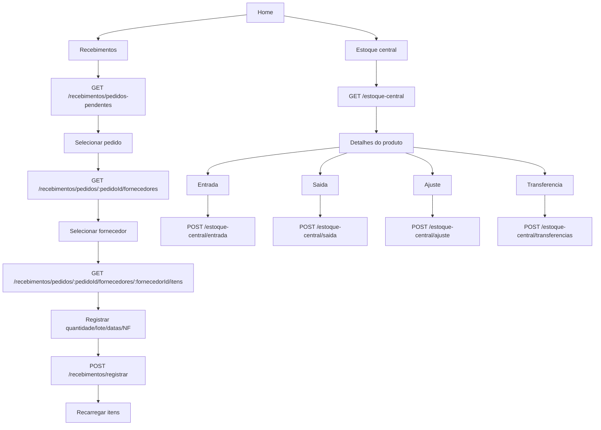

# Fluxo: App Entregador - recebimentos e estoque central

## Evidencias

- `apps/entregador-native/src/api/recebimentos.ts`
- `apps/entregador-native/src/screens/RecebimentosScreen.tsx`
- `apps/entregador-native/src/screens/RecebimentoFornecedoresScreen.tsx`
- `apps/entregador-native/src/screens/RecebimentoItensScreen.tsx`
- `apps/entregador-native/src/api/estoqueCentral.ts`
- `apps/entregador-native/src/screens/EstoqueCentralScreen.tsx`
- `apps/entregador-native/src/screens/EstoqueCentralEntradaScreen.tsx`
- `apps/entregador-native/src/screens/EstoqueCentralSaidaScreen.tsx`
- `apps/entregador-native/src/screens/EstoqueCentralAjusteScreen.tsx`
- `apps/entregador-native/src/screens/EstoqueCentralTransferenciaScreen.tsx`
