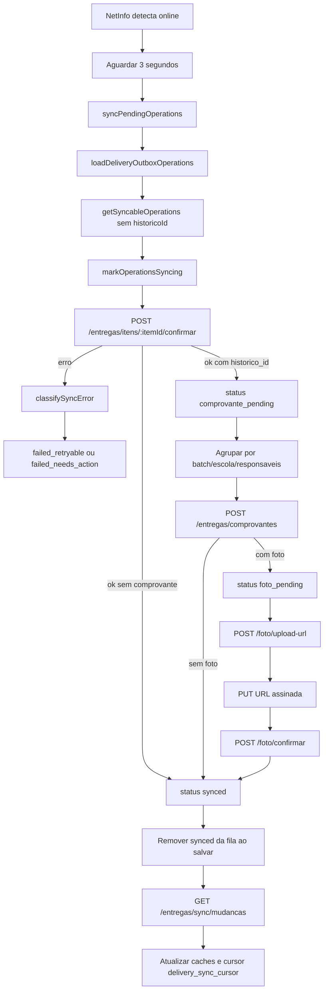

# Fluxo: App Entregador - sincronizacao, comprovante e foto

## Evidencias

- `apps/entregador-native/src/contexts/OfflineContext.tsx`
- `apps/entregador-native/src/services/deliveryOutboxCore.ts`
- `apps/entregador-native/src/services/deliveryPhotoUpload.ts`
- `apps/entregador-native/src/services/deliveryRemoteChanges.ts`
