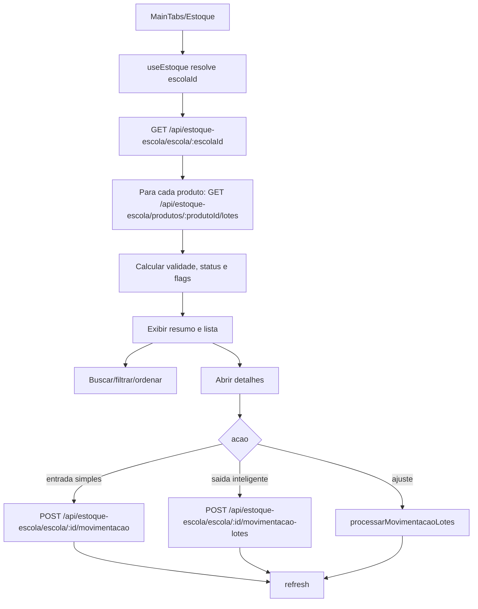

# Fluxo: App Estoque Escolar - consulta e movimentacao

## Evidencias

- `apps/estoque-escolar-mobile/src/hooks/useEstoque.ts`
- `apps/estoque-escolar-mobile/src/services/api.ts`
- `apps/estoque-escolar-mobile/src/screens/EstoqueScreen.tsx`
- `apps/estoque-escolar-mobile/src/components/ModalEntradaSimples.tsx`
- `apps/estoque-escolar-mobile/src/components/ModalSaidaInteligente.tsx`
- `apps/estoque-escolar-mobile/src/components/ModalLotesValidade.tsx`
