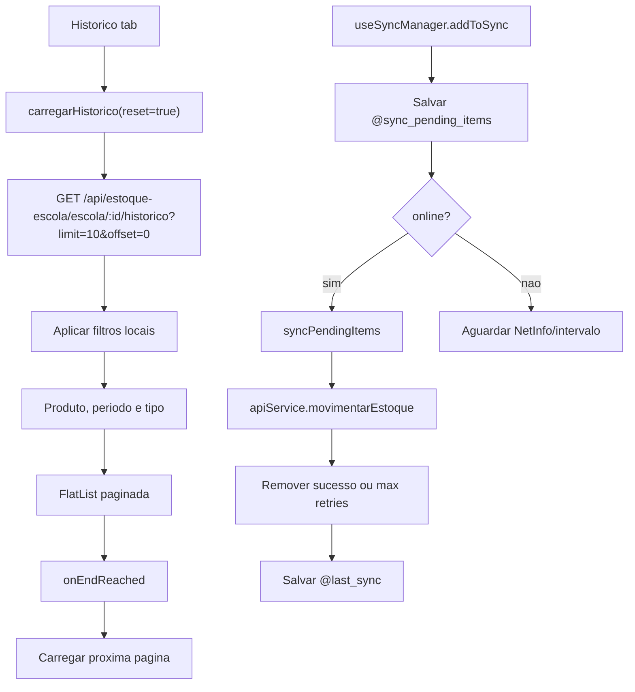

# Fluxo: App Estoque Escolar - historico e sync pendente

## Evidencias

- `apps/estoque-escolar-mobile/src/screens/HistoricoScreen.tsx`
- `apps/estoque-escolar-mobile/src/hooks/useEstoque.ts`
- `apps/estoque-escolar-mobile/src/hooks/useSyncManager.ts`
