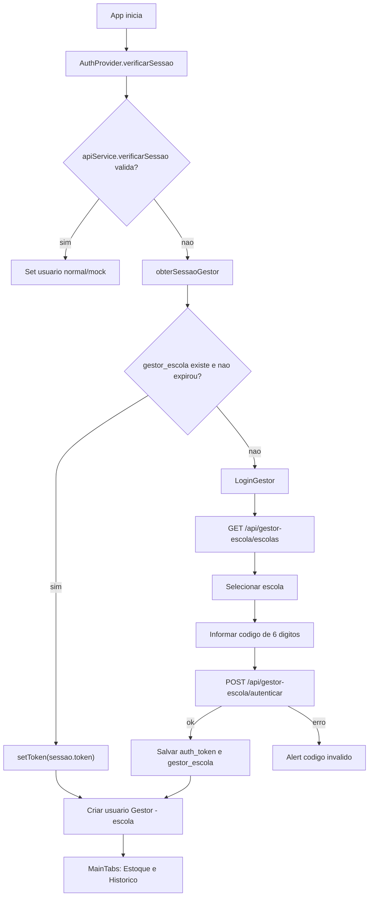

# Fluxo: App Estoque Escolar - login do gestor

## Evidencias

- `apps/estoque-escolar-mobile/src/contexts/AuthContext.tsx`
- `apps/estoque-escolar-mobile/src/screens/LoginGestorScreen.tsx`
- `apps/estoque-escolar-mobile/src/services/gestorEscola.ts`
- `apps/estoque-escolar-mobile/src/services/api.ts`
