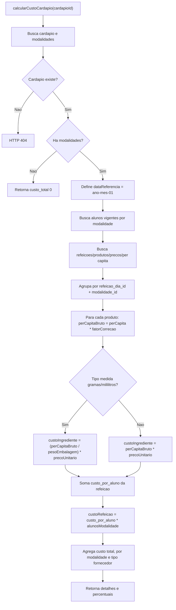

# Fluxograma por Funcao - cardapios/calcularCustoCardapio

```mermaid
flowchart TD
  A["calcularCustoCardapio(cardapioId)"] --> B["Busca cardapio e modalidades"]
  B --> C{"Cardapio existe?"}
  C -- "Nao" --> D["HTTP 404"]
  C -- "Sim" --> E{"Ha modalidades?"}
  E -- "Nao" --> F["Retorna custo_total 0"]
  E -- "Sim" --> G["Define dataReferencia = ano-mes-01"]
  G --> H["Busca alunos vigentes por modalidade"]
  H --> I["Busca refeicoes/produtos/precos/per capita"]
  I --> J["Agrupa por refeicao_dia_id + modalidade_id"]
  J --> K["Para cada produto: perCapitaBruto = perCapita * fatorCorrecao"]
  K --> L{"Tipo medida gramas/mililitros?"}
  L -- "Sim" --> M["custoIngrediente = (perCapitaBruto / pesoEmbalagem) * precoUnitario"]
  L -- "Nao" --> N["custoIngrediente = perCapitaBruto * precoUnitario"]
  M --> O["Soma custo_por_aluno da refeicao"]
  N --> O
  O --> P["custoRefeicao = custo_por_aluno * alunosModalidade"]
  P --> Q["Agrega custo total, por modalidade e tipo fornecedor"]
  Q --> R["Retorna detalhes e percentuais"]
```
