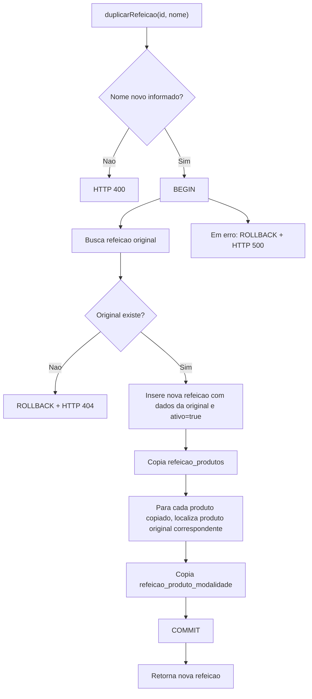

# Fluxograma por Funcao - cardapios/duplicarRefeicao

```mermaid
flowchart TD
  A["duplicarRefeicao(id, nome)"] --> B{"Nome novo informado?"}
  B -- "Nao" --> C["HTTP 400"]
  B -- "Sim" --> D["BEGIN"]
  D --> E["Busca refeicao original"]
  E --> F{"Original existe?"}
  F -- "Nao" --> G["ROLLBACK + HTTP 404"]
  F -- "Sim" --> H["Insere nova refeicao com dados da original e ativo=true"]
  H --> I["Copia refeicao_produtos"]
  I --> J["Para cada produto copiado, localiza produto original correspondente"]
  J --> K["Copia refeicao_produto_modalidade"]
  K --> L["COMMIT"]
  L --> M["Retorna nova refeicao"]
  D --> N["Em erro: ROLLBACK + HTTP 500"]
```
