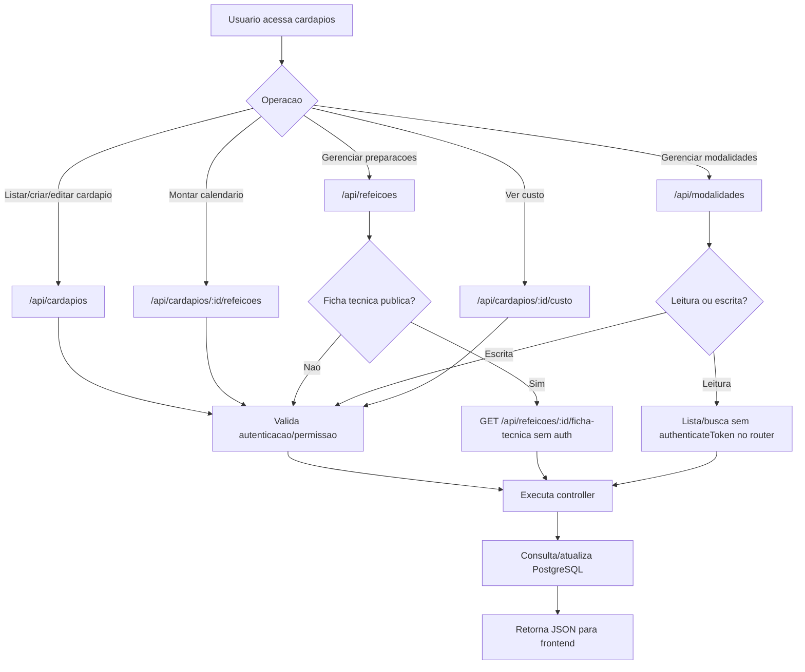

# Fluxograma - Modulo cardapios

```mermaid
flowchart TD
  A["Usuario acessa cardapios"] --> B{"Operacao"}
  B -- "Listar/criar/editar cardapio" --> C["/api/cardapios"]
  B -- "Montar calendario" --> D["/api/cardapios/:id/refeicoes"]
  B -- "Gerenciar preparacoes" --> E["/api/refeicoes"]
  B -- "Gerenciar modalidades" --> F["/api/modalidades"]
  B -- "Ver custo" --> G["/api/cardapios/:id/custo"]
  C --> H["Valida autenticacao/permissao"]
  D --> H
  E --> I{"Ficha tecnica publica?"}
  I -- "Sim" --> J["GET /api/refeicoes/:id/ficha-tecnica sem auth"]
  I -- "Nao" --> H
  F --> K{"Leitura ou escrita?"}
  K -- "Leitura" --> L["Lista/busca sem authenticateToken no router"]
  K -- "Escrita" --> H
  G --> H
  H --> M["Executa controller"]
  J --> M
  L --> M
  M --> N["Consulta/atualiza PostgreSQL"]
  N --> O["Retorna JSON para frontend"]
```
