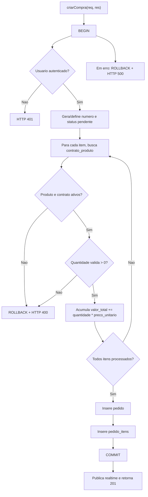

# Fluxograma por Funcao - compras/criarCompra

```mermaid
flowchart TD
  A["criarCompra(req, res)"] --> B["BEGIN"]
  B --> C{"Usuario autenticado?"}
  C -- "Nao" --> D["HTTP 401"]
  C -- "Sim" --> E["Gera/define numero e status pendente"]
  E --> F["Para cada item, busca contrato_produto"]
  F --> G{"Produto e contrato ativos?"}
  G -- "Nao" --> H["ROLLBACK + HTTP 400"]
  G -- "Sim" --> I{"Quantidade valida > 0?"}
  I -- "Nao" --> H
  I -- "Sim" --> J["Acumula valor_total += quantidade * preco_unitario"]
  J --> K{"Todos itens processados?"}
  K -- "Nao" --> F
  K -- "Sim" --> L["Insere pedido"]
  L --> M["Insere pedido_itens"]
  M --> N["COMMIT"]
  N --> O["Publica realtime e retorna 201"]
  B --> P["Em erro: ROLLBACK + HTTP 500"]
```
