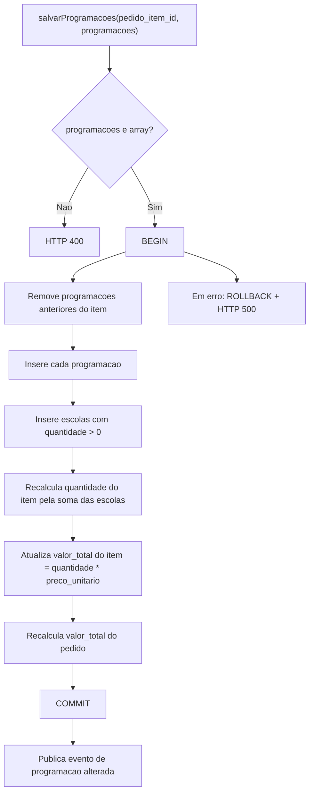

# Fluxograma por Funcao - compras/salvarProgramacoes

```mermaid
flowchart TD
  A["salvarProgramacoes(pedido_item_id, programacoes)"] --> B{"programacoes e array?"}
  B -- "Nao" --> C["HTTP 400"]
  B -- "Sim" --> D["BEGIN"]
  D --> E["Remove programacoes anteriores do item"]
  E --> F["Insere cada programacao"]
  F --> G["Insere escolas com quantidade > 0"]
  G --> H["Recalcula quantidade do item pela soma das escolas"]
  H --> I["Atualiza valor_total do item = quantidade * preco_unitario"]
  I --> J["Recalcula valor_total do pedido"]
  J --> K["COMMIT"]
  K --> L["Publica evento de programacao alterada"]
  D --> M["Em erro: ROLLBACK + HTTP 500"]
```
