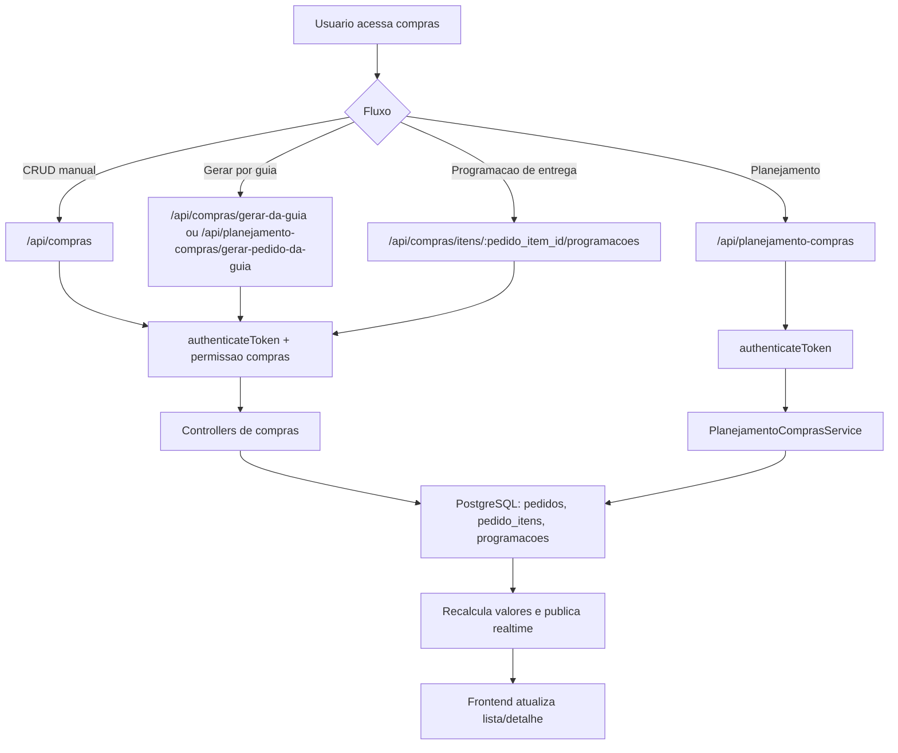

# Fluxograma - Modulo compras

```mermaid
flowchart TD
  A["Usuario acessa compras"] --> B{"Fluxo"}
  B -- "CRUD manual" --> C["/api/compras"]
  B -- "Gerar por guia" --> D["/api/compras/gerar-da-guia ou /api/planejamento-compras/gerar-pedido-da-guia"]
  B -- "Planejamento" --> E["/api/planejamento-compras"]
  B -- "Programacao de entrega" --> F["/api/compras/itens/:pedido_item_id/programacoes"]
  C --> G["authenticateToken + permissao compras"]
  D --> G
  E --> H["authenticateToken"]
  F --> G
  G --> I["Controllers de compras"]
  H --> J["PlanejamentoComprasService"]
  I --> K["PostgreSQL: pedidos, pedido_itens, programacoes"]
  J --> K
  K --> L["Recalcula valores e publica realtime"]
  L --> M["Frontend atualiza lista/detalhe"]
```
