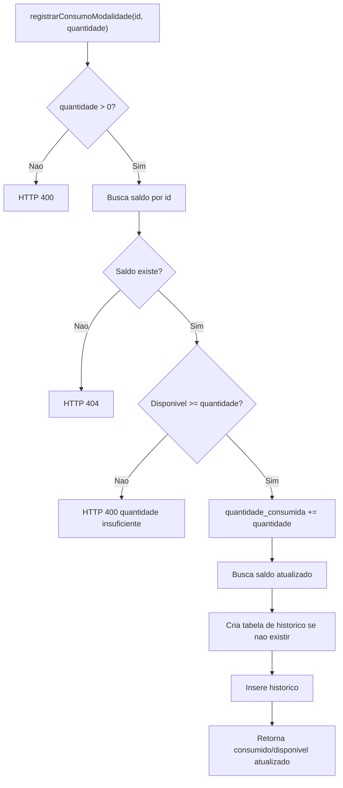

# Fluxograma por Funcao - contratos/registrarConsumoModalidade

```mermaid
flowchart TD
  A["registrarConsumoModalidade(id, quantidade)"] --> B{"quantidade > 0?"}
  B -- "Nao" --> C["HTTP 400"]
  B -- "Sim" --> D["Busca saldo por id"]
  D --> E{"Saldo existe?"}
  E -- "Nao" --> F["HTTP 404"]
  E -- "Sim" --> G{"Disponivel >= quantidade?"}
  G -- "Nao" --> H["HTTP 400 quantidade insuficiente"]
  G -- "Sim" --> I["quantidade_consumida += quantidade"]
  I --> J["Busca saldo atualizado"]
  J --> K["Cria tabela de historico se nao existir"]
  K --> L["Insere historico"]
  L --> M["Retorna consumido/disponivel atualizado"]
```
