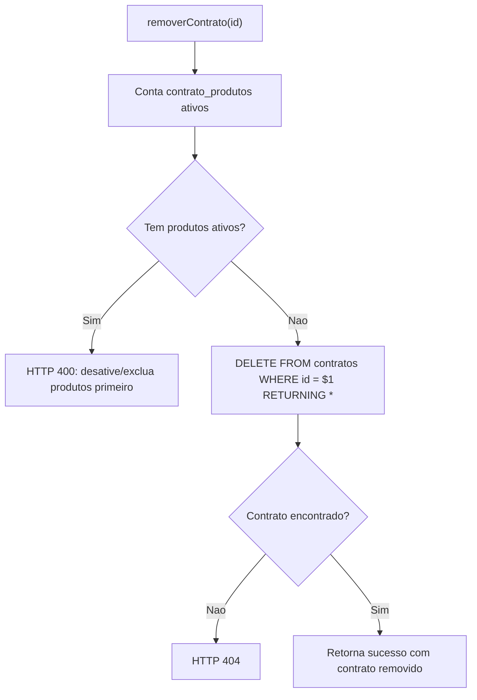

# Fluxograma por Funcao - contratos/removerContrato

```mermaid
flowchart TD
  A["removerContrato(id)"] --> B["Conta contrato_produtos ativos"]
  B --> C{"Tem produtos ativos?"}
  C -- "Sim" --> D["HTTP 400: desative/exclua produtos primeiro"]
  C -- "Nao" --> E["DELETE FROM contratos WHERE id = $1 RETURNING *"]
  E --> F{"Contrato encontrado?"}
  F -- "Nao" --> G["HTTP 404"]
  F -- "Sim" --> H["Retorna sucesso com contrato removido"]
```
