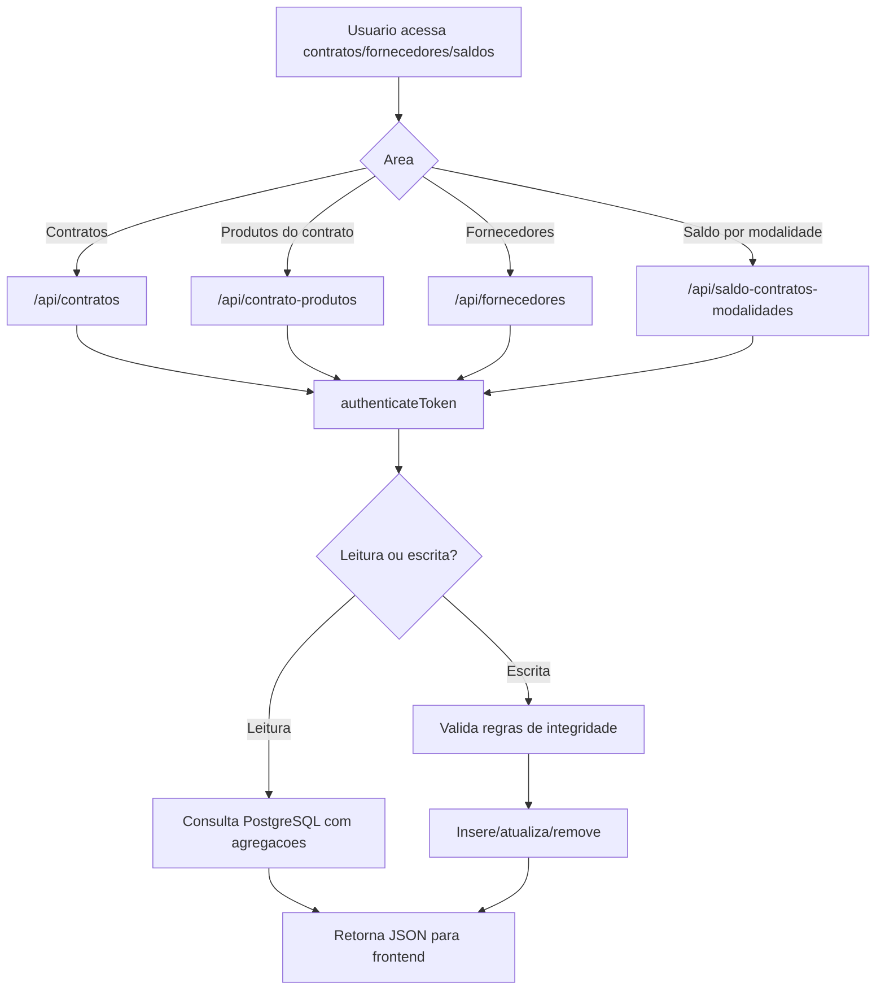

# Fluxograma - Modulo contratos

```mermaid
flowchart TD
  A["Usuario acessa contratos/fornecedores/saldos"] --> B{"Area"}
  B -- "Contratos" --> C["/api/contratos"]
  B -- "Produtos do contrato" --> D["/api/contrato-produtos"]
  B -- "Fornecedores" --> E["/api/fornecedores"]
  B -- "Saldo por modalidade" --> F["/api/saldo-contratos-modalidades"]
  C --> G["authenticateToken"]
  D --> G
  E --> G
  F --> G
  G --> H{"Leitura ou escrita?"}
  H -- "Leitura" --> I["Consulta PostgreSQL com agregacoes"]
  H -- "Escrita" --> J["Valida regras de integridade"]
  J --> K["Insere/atualiza/remove"]
  I --> L["Retorna JSON para frontend"]
  K --> L
```
