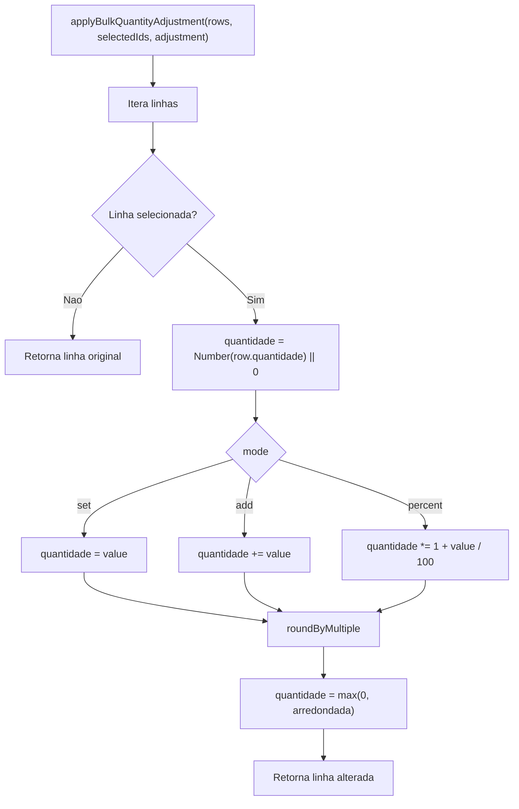

# Fluxograma por Funcao - demandas/applyBulkQuantityAdjustment

```mermaid
flowchart TD
  A["applyBulkQuantityAdjustment(rows, selectedIds, adjustment)"] --> B["Itera linhas"]
  B --> C{"Linha selecionada?"}
  C -- "Nao" --> D["Retorna linha original"]
  C -- "Sim" --> E["quantidade = Number(row.quantidade) || 0"]
  E --> F{"mode"}
  F -- "set" --> G["quantidade = value"]
  F -- "add" --> H["quantidade += value"]
  F -- "percent" --> I["quantidade *= 1 + value / 100"]
  G --> J["roundByMultiple"]
  H --> J
  I --> J
  J --> K["quantidade = max(0, arredondada)"]
  K --> L["Retorna linha alterada"]
```
