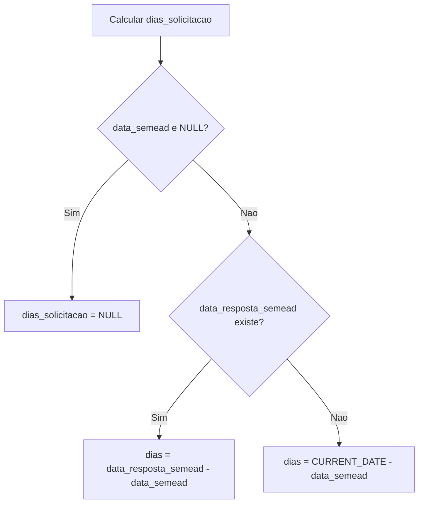

# Fluxograma por Funcao - demandas/calculo dias_solicitacao

```mermaid
flowchart TD
  A["Calcular dias_solicitacao"] --> B{"data_semead e NULL?"}
  B -- "Sim" --> C["dias_solicitacao = NULL"]
  B -- "Nao" --> D{"data_resposta_semead existe?"}
  D -- "Sim" --> E["dias = data_resposta_semead - data_semead"]
  D -- "Nao" --> F["dias = CURRENT_DATE - data_semead"]
```
