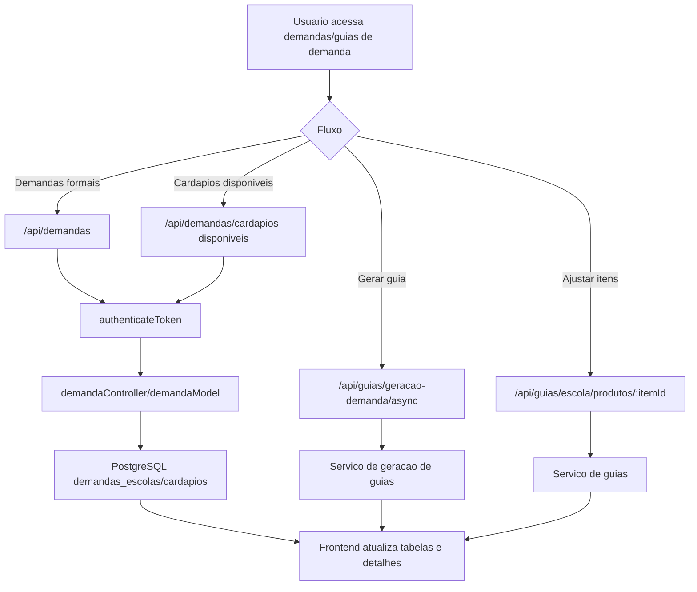

# Fluxograma - Modulo demandas

```mermaid
flowchart TD
  A["Usuario acessa demandas/guias de demanda"] --> B{"Fluxo"}
  B -- "Demandas formais" --> C["/api/demandas"]
  B -- "Cardapios disponiveis" --> D["/api/demandas/cardapios-disponiveis"]
  B -- "Gerar guia" --> E["/api/guias/geracao-demanda/async"]
  B -- "Ajustar itens" --> F["/api/guias/escola/produtos/:itemId"]
  C --> G["authenticateToken"]
  D --> G
  G --> H["demandaController/demandaModel"]
  H --> I["PostgreSQL demandas_escolas/cardapios"]
  E --> J["Servico de geracao de guias"]
  F --> K["Servico de guias"]
  I --> L["Frontend atualiza tabelas e detalhes"]
  J --> L
  K --> L
```
