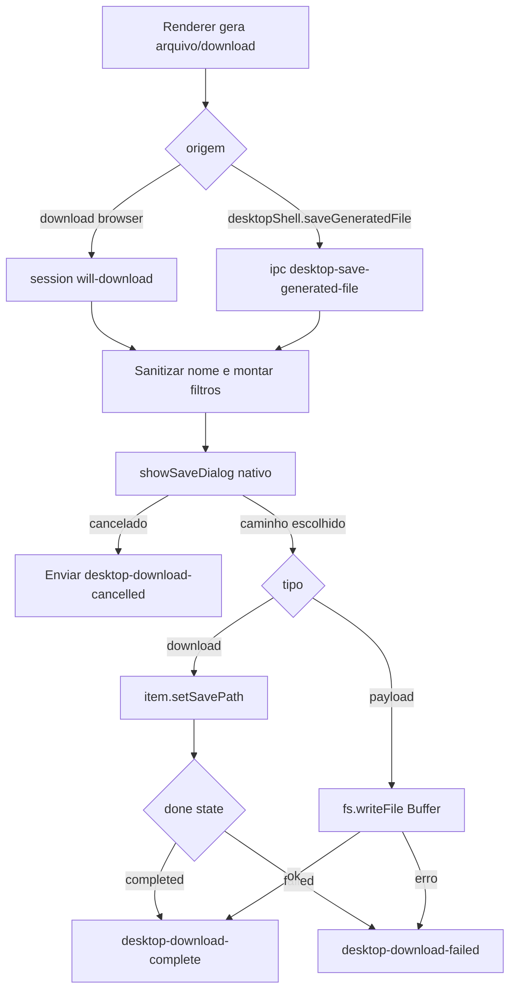

# Fluxo: Desktop - downloads e arquivos gerados

```mermaid
flowchart TD
  A["Renderer gera arquivo/download"] --> B{"origem"}
  B -->|download browser| C["session will-download"]
  B -->|desktopShell.saveGeneratedFile| D["ipc desktop-save-generated-file"]
  C --> E["Sanitizar nome e montar filtros"]
  D --> E
  E --> F["showSaveDialog nativo"]
  F -->|cancelado| G["Enviar desktop-download-cancelled"]
  F -->|caminho escolhido| H{"tipo"}
  H -->|download| I["item.setSavePath"]
  H -->|payload| J["fs.writeFile Buffer"]
  I --> K{"done state"}
  K -->|completed| L["desktop-download-complete"]
  K -->|failed| M["desktop-download-failed"]
  J -->|ok| L
  J -->|erro| M
```

## Evidencias

- `desktop/downloads.cjs`
- `desktop/preload.cjs`
- `desktop/main.cjs`
