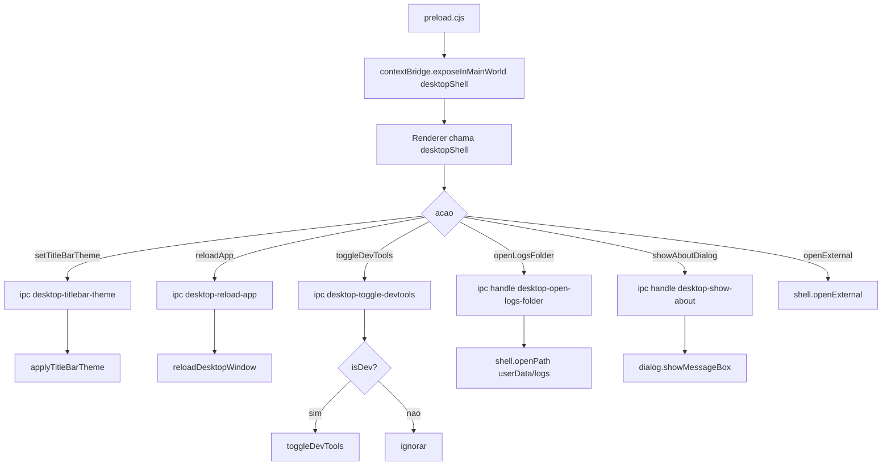

# Fluxo: Desktop - preload e acoes da janela

```mermaid
flowchart TD
  A["preload.cjs"] --> B["contextBridge.exposeInMainWorld desktopShell"]
  B --> C["Renderer chama desktopShell"]
  C --> D{"acao"}
  D -->|setTitleBarTheme| E["ipc desktop-titlebar-theme"]
  D -->|reloadApp| F["ipc desktop-reload-app"]
  D -->|toggleDevTools| G["ipc desktop-toggle-devtools"]
  D -->|openLogsFolder| H["ipc handle desktop-open-logs-folder"]
  D -->|showAboutDialog| I["ipc handle desktop-show-about"]
  D -->|openExternal| J["shell.openExternal"]
  E --> K["applyTitleBarTheme"]
  F --> L["reloadDesktopWindow"]
  G --> M{"isDev?"}
  M -->|sim| N["toggleDevTools"]
  M -->|nao| O["ignorar"]
  H --> P["shell.openPath userData/logs"]
  I --> Q["dialog.showMessageBox"]
```

## Evidencias

- `desktop/preload.cjs`
- `desktop/main.cjs`
- `desktop/window-actions.cjs`
- `desktop/window-appearance.cjs`
