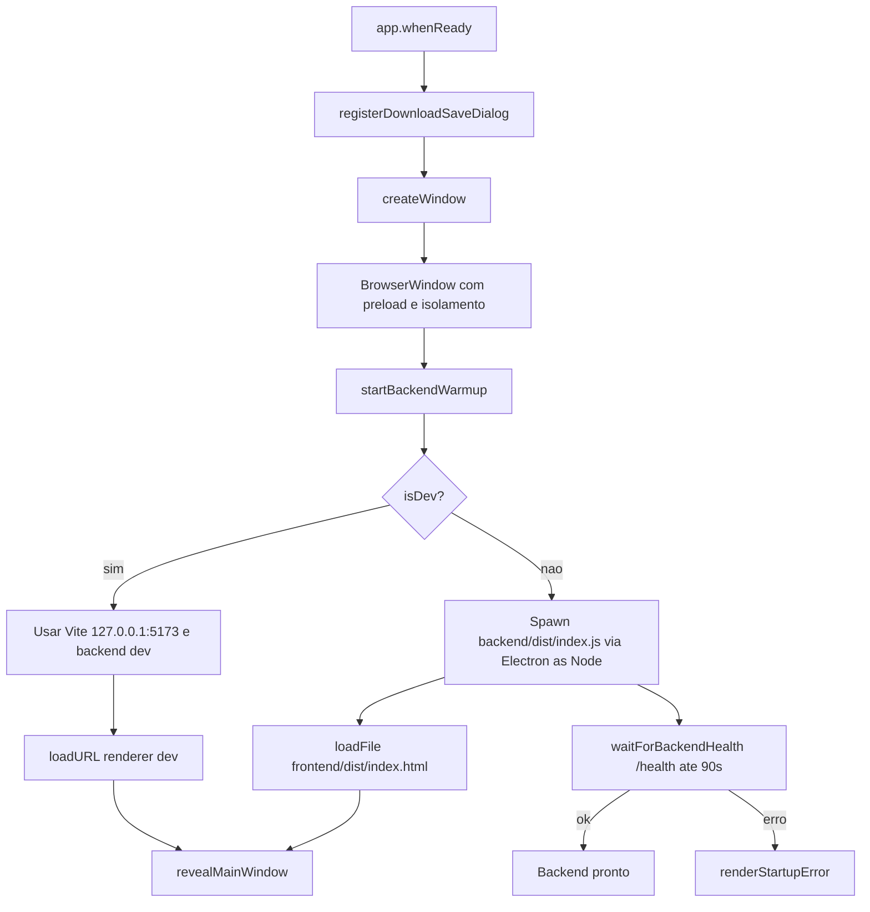

# Fluxo: Desktop - inicializacao

```mermaid
flowchart TD
  A["app.whenReady"] --> B["registerDownloadSaveDialog"]
  B --> C["createWindow"]
  C --> D["BrowserWindow com preload e isolamento"]
  D --> E["startBackendWarmup"]
  E --> F{"isDev?"}
  F -->|sim| G["Usar Vite 127.0.0.1:5173 e backend dev"]
  F -->|nao| H["Spawn backend/dist/index.js via Electron as Node"]
  H --> I["waitForBackendHealth /health ate 90s"]
  I -->|ok| J["Backend pronto"]
  I -->|erro| K["renderStartupError"]
  G --> L["loadURL renderer dev"]
  H --> M["loadFile frontend/dist/index.html"]
  L --> N["revealMainWindow"]
  M --> N
```

## Evidencias

- `desktop/main.cjs`
- `desktop/backend-service.cjs`
