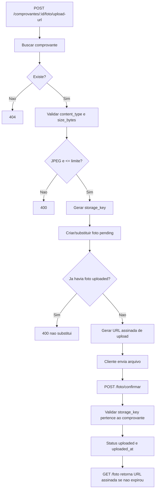

# Fluxo - Foto de Comprovante

```mermaid
flowchart TD
  A["POST /comprovantes/:id/foto/upload-url"] --> B["Buscar comprovante"]
  B --> C{"Existe?"}
  C -->|Nao| D["404"]
  C -->|Sim| E["Validar content_type e size_bytes"]
  E --> F{"JPEG e <= limite?"}
  F -->|Nao| G["400"]
  F -->|Sim| H["Gerar storage_key"]
  H --> I["Criar/substituir foto pending"]
  I --> J{"Ja havia foto uploaded?"}
  J -->|Sim| K["400 nao substitui"]
  J -->|Nao| L["Gerar URL assinada de upload"]
  L --> M["Cliente envia arquivo"]
  M --> N["POST /foto/confirmar"]
  N --> O["Validar storage_key pertence ao comprovante"]
  O --> P["Status uploaded e uploaded_at"]
  P --> Q["GET /foto retorna URL assinada se nao expirou"]
```
