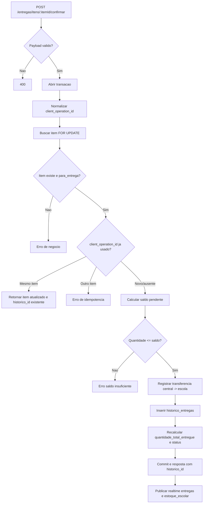

# Fluxo - Confirmar Entrega

```mermaid
flowchart TD
  A["POST /entregas/itens/:itemId/confirmar"] --> B{"Payload valido?"}
  B -->|Nao| C["400"]
  B -->|Sim| D["Abrir transacao"]
  D --> E["Normalizar client_operation_id"]
  E --> F["Buscar item FOR UPDATE"]
  F --> G{"Item existe e para_entrega?"}
  G -->|Nao| H["Erro de negocio"]
  G -->|Sim| I{"client_operation_id ja usado?"}
  I -->|Mesmo item| J["Retornar item atualizado e historico_id existente"]
  I -->|Outro item| K["Erro de idempotencia"]
  I -->|Novo/ausente| L["Calcular saldo pendente"]
  L --> M{"Quantidade <= saldo?"}
  M -->|Nao| N["Erro saldo insuficiente"]
  M -->|Sim| O["Registrar transferencia central -> escola"]
  O --> P["Inserir historico_entregas"]
  P --> Q["Recalcular quantidade_total_entregue e status"]
  Q --> R["Commit e resposta com historico_id"]
  R --> S["Publicar realtime entregas e estoque_escolar"]
```
