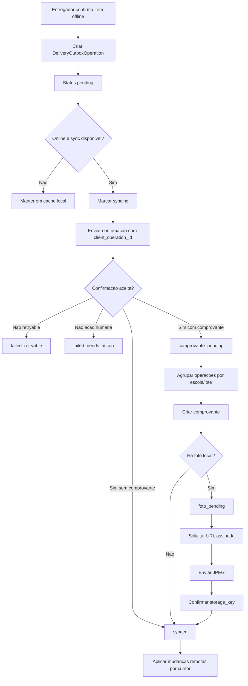

# Fluxo - Sincronizacao Offline de Entregas

```mermaid
flowchart TD
  A["Entregador confirma item offline"] --> B["Criar DeliveryOutboxOperation"]
  B --> C["Status pending"]
  C --> D{"Online e sync disponivel?"}
  D -->|Nao| E["Manter em cache local"]
  D -->|Sim| F["Marcar syncing"]
  F --> G["Enviar confirmacao com client_operation_id"]
  G --> H{"Confirmacao aceita?"}
  H -->|Nao retryable| I["failed_retryable"]
  H -->|Nao acao humana| J["failed_needs_action"]
  H -->|Sim sem comprovante| K["synced"]
  H -->|Sim com comprovante| L["comprovante_pending"]
  L --> M["Agrupar operacoes por escola/lote"]
  M --> N["Criar comprovante"]
  N --> O{"Ha foto local?"}
  O -->|Nao| K
  O -->|Sim| P["foto_pending"]
  P --> Q["Solicitar URL assinada"]
  Q --> R["Enviar JPEG"]
  R --> S["Confirmar storage_key"]
  S --> K
  K --> T["Aplicar mudancas remotas por cursor"]
```
