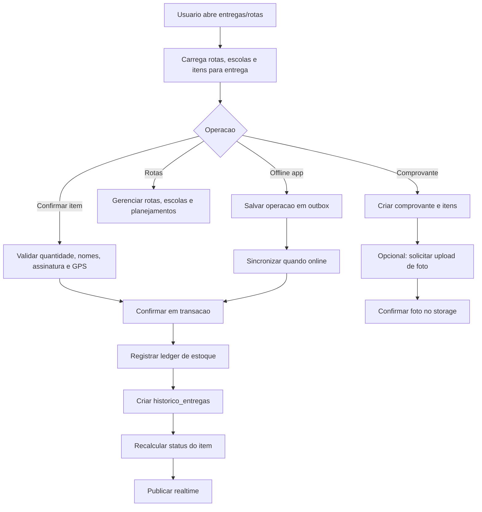

# Fluxo - Modulo Entregas

```mermaid
flowchart TD
  A["Usuario abre entregas/rotas"] --> B["Carrega rotas, escolas e itens para entrega"]
  B --> C{"Operacao"}
  C -->|Confirmar item| D["Validar quantidade, nomes, assinatura e GPS"]
  D --> E["Confirmar em transacao"]
  E --> F["Registrar ledger de estoque"]
  F --> G["Criar historico_entregas"]
  G --> H["Recalcular status do item"]
  H --> I["Publicar realtime"]
  C -->|Comprovante| J["Criar comprovante e itens"]
  J --> K["Opcional: solicitar upload de foto"]
  K --> L["Confirmar foto no storage"]
  C -->|Rotas| M["Gerenciar rotas, escolas e planejamentos"]
  C -->|Offline app| N["Salvar operacao em outbox"]
  N --> O["Sincronizar quando online"]
  O --> E
```
