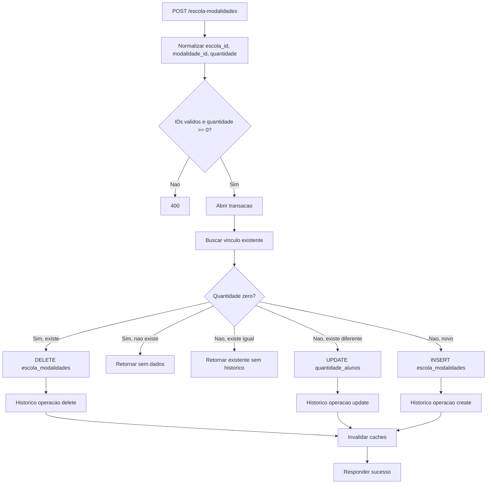

# Fluxo - Salvar Alunos por Modalidade

```mermaid
flowchart TD
  A["POST /escola-modalidades"] --> B["Normalizar escola_id, modalidade_id, quantidade"]
  B --> C{"IDs validos e quantidade >= 0?"}
  C -->|Nao| D["400"]
  C -->|Sim| E["Abrir transacao"]
  E --> F["Buscar vinculo existente"]
  F --> G{"Quantidade zero?"}
  G -->|Sim, existe| H["DELETE escola_modalidades"]
  H --> I["Historico operacao delete"]
  G -->|Sim, nao existe| J["Retornar sem dados"]
  G -->|Nao, existe igual| K["Retornar existente sem historico"]
  G -->|Nao, existe diferente| L["UPDATE quantidade_alunos"]
  L --> M["Historico operacao update"]
  G -->|Nao, novo| N["INSERT escola_modalidades"]
  N --> O["Historico operacao create"]
  I --> P["Invalidar caches"]
  M --> P
  O --> P
  P --> Q["Responder sucesso"]
```
