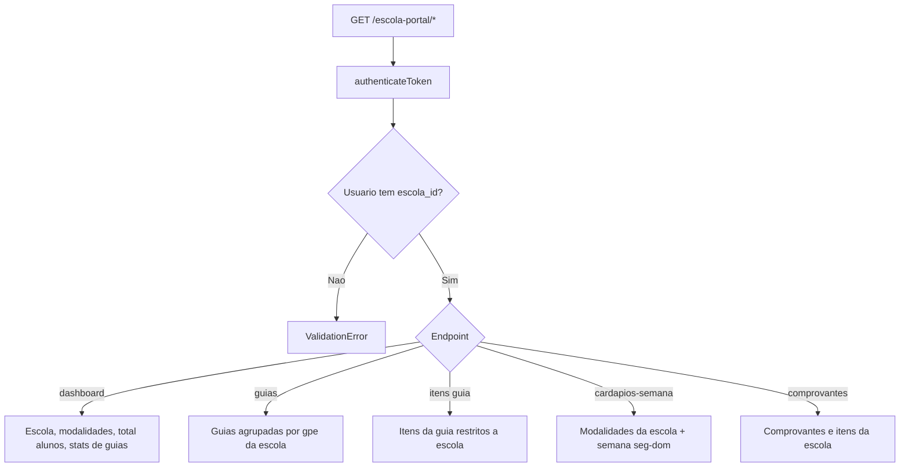

# Fluxo - Portal da Escola

```mermaid
flowchart TD
  A["GET /escola-portal/*"] --> B["authenticateToken"]
  B --> C{"Usuario tem escola_id?"}
  C -->|Nao| D["ValidationError"]
  C -->|Sim| E{"Endpoint"}
  E -->|dashboard| F["Escola, modalidades, total alunos, stats de guias"]
  E -->|guias| G["Guias agrupadas por gpe da escola"]
  E -->|itens guia| H["Itens da guia restritos a escola"]
  E -->|cardapios-semana| I["Modalidades da escola + semana seg-dom"]
  E -->|comprovantes| J["Comprovantes e itens da escola"]
```
