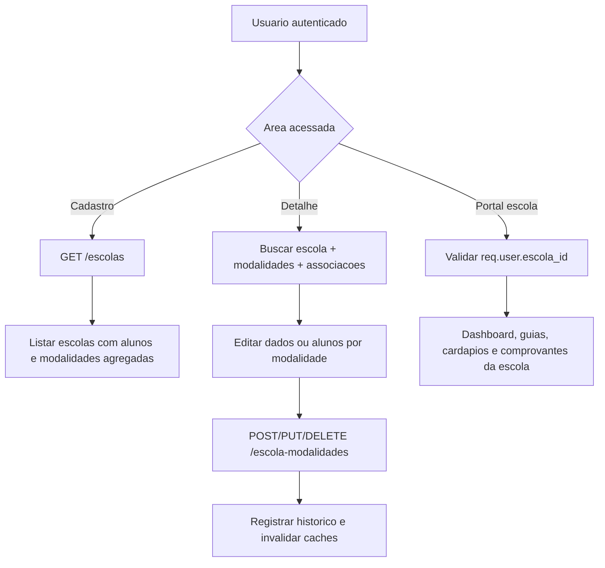

# Fluxo - Modulo Escolas

```mermaid
flowchart TD
  A["Usuario autenticado"] --> B{"Area acessada"}
  B -->|Cadastro| C["GET /escolas"]
  C --> D["Listar escolas com alunos e modalidades agregadas"]
  B -->|Detalhe| E["Buscar escola + modalidades + associacoes"]
  E --> F["Editar dados ou alunos por modalidade"]
  F --> G["POST/PUT/DELETE /escola-modalidades"]
  G --> H["Registrar historico e invalidar caches"]
  B -->|Portal escola| I["Validar req.user.escola_id"]
  I --> J["Dashboard, guias, cardapios e comprovantes da escola"]
```
