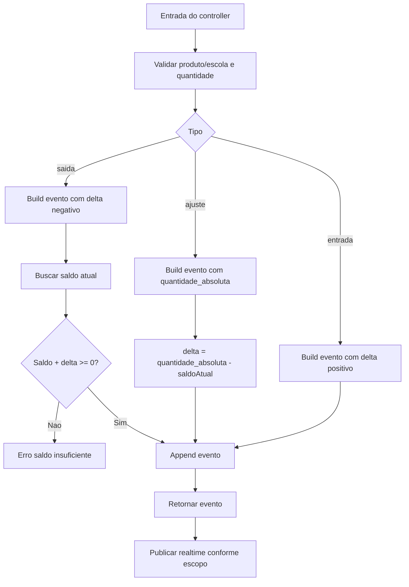

# Fluxo - Registrar Movimento de Estoque

```mermaid
flowchart TD
  A["Entrada do controller"] --> B["Validar produto/escola e quantidade"]
  B --> C{"Tipo"}
  C -->|entrada| D["Build evento com delta positivo"]
  C -->|saida| E["Build evento com delta negativo"]
  C -->|ajuste| F["Build evento com quantidade_absoluta"]
  E --> G["Buscar saldo atual"]
  G --> H{"Saldo + delta >= 0?"}
  H -->|Nao| I["Erro saldo insuficiente"]
  H -->|Sim| J["Append evento"]
  F --> K["delta = quantidade_absoluta - saldoAtual"]
  K --> J
  D --> J
  J --> L["Retornar evento"]
  L --> M["Publicar realtime conforme escopo"]
```
