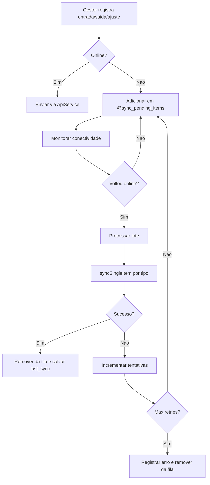

# Fluxo - Sync Mobile Estoque Escolar

```mermaid
flowchart TD
  A["Gestor registra entrada/saida/ajuste"] --> B{"Online?"}
  B -->|Sim| C["Enviar via ApiService"]
  B -->|Nao| D["Adicionar em @sync_pending_items"]
  D --> E["Monitorar conectividade"]
  E --> F{"Voltou online?"}
  F -->|Nao| D
  F -->|Sim| G["Processar lote"]
  G --> H["syncSingleItem por tipo"]
  H --> I{"Sucesso?"}
  I -->|Sim| J["Remover da fila e salvar last_sync"]
  I -->|Nao| K["Incrementar tentativas"]
  K --> L{"Max retries?"}
  L -->|Nao| D
  L -->|Sim| M["Registrar erro e remover da fila"]
```
