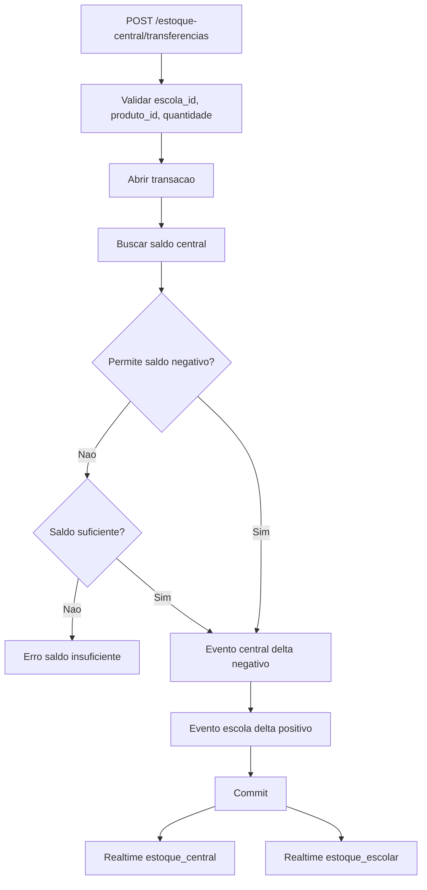

# Fluxo - Transferencia Central para Escola

```mermaid
flowchart TD
  A["POST /estoque-central/transferencias"] --> B["Validar escola_id, produto_id, quantidade"]
  B --> C["Abrir transacao"]
  C --> D["Buscar saldo central"]
  D --> E{"Permite saldo negativo?"}
  E -->|Nao| F{"Saldo suficiente?"}
  F -->|Nao| G["Erro saldo insuficiente"]
  F -->|Sim| H["Evento central delta negativo"]
  E -->|Sim| H
  H --> I["Evento escola delta positivo"]
  I --> J["Commit"]
  J --> K["Realtime estoque_central"]
  J --> L["Realtime estoque_escolar"]
```
