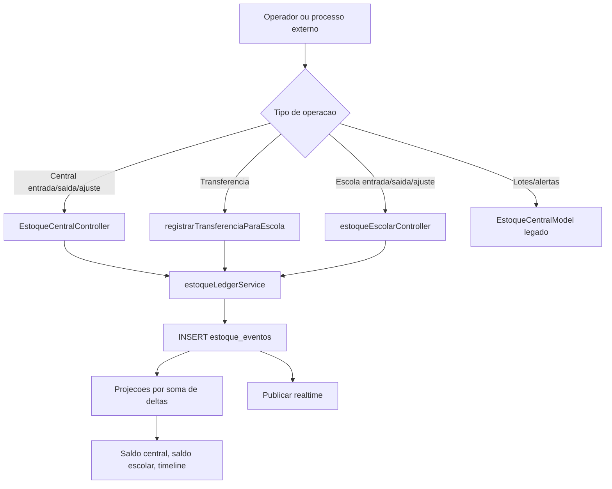

# Fluxo - Modulo Estoque

```mermaid
flowchart TD
  A["Operador ou processo externo"] --> B{"Tipo de operacao"}
  B -->|Central entrada/saida/ajuste| C["EstoqueCentralController"]
  B -->|Transferencia| D["registrarTransferenciaParaEscola"]
  B -->|Escola entrada/saida/ajuste| E["estoqueEscolarController"]
  C --> F["estoqueLedgerService"]
  D --> F
  E --> F
  F --> G["INSERT estoque_eventos"]
  G --> H["Projecoes por soma de deltas"]
  H --> I["Saldo central, saldo escolar, timeline"]
  G --> J["Publicar realtime"]
  B -->|Lotes/alertas| K["EstoqueCentralModel legado"]
```
