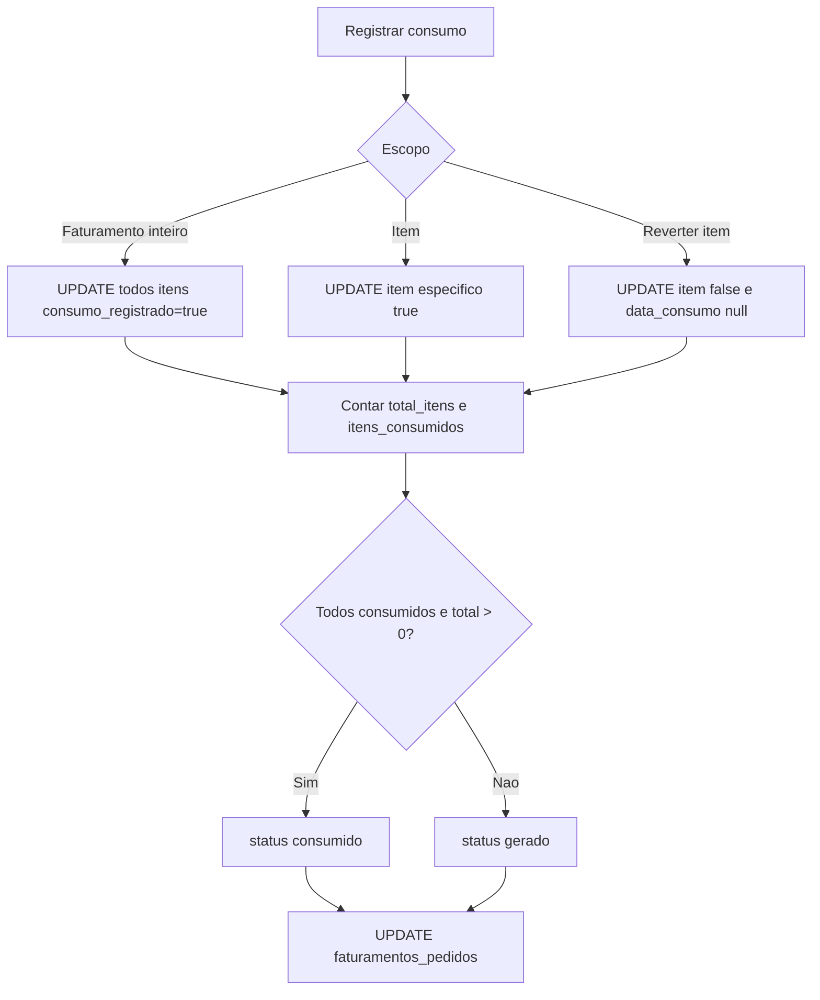

# Fluxo - Consumo do Faturamento

```mermaid
flowchart TD
  A["Registrar consumo"] --> B{"Escopo"}
  B -->|Faturamento inteiro| C["UPDATE todos itens consumo_registrado=true"]
  B -->|Item| D["UPDATE item especifico true"]
  B -->|Reverter item| E["UPDATE item false e data_consumo null"]
  C --> F["Contar total_itens e itens_consumidos"]
  D --> F
  E --> F
  F --> G{"Todos consumidos e total > 0?"}
  G -->|Sim| H["status consumido"]
  G -->|Nao| I["status gerado"]
  H --> J["UPDATE faturamentos_pedidos"]
  I --> J
```
