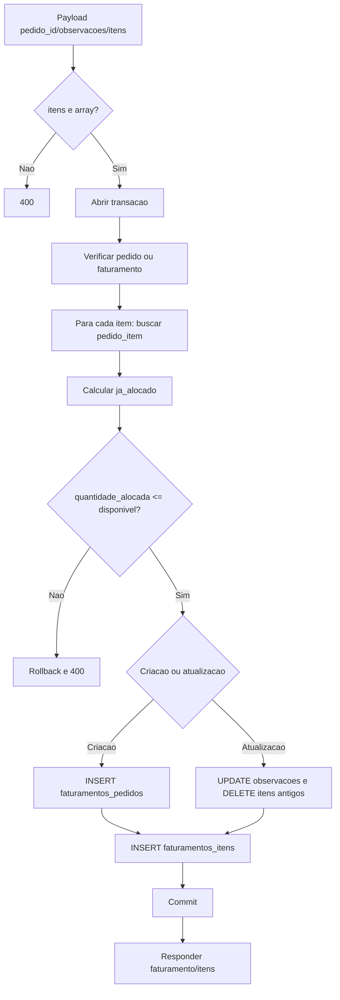

# Fluxo - Criar ou Atualizar Faturamento

```mermaid
flowchart TD
  A["Payload pedido_id/observacoes/itens"] --> B{"itens e array?"}
  B -->|Nao| C["400"]
  B -->|Sim| D["Abrir transacao"]
  D --> E["Verificar pedido ou faturamento"]
  E --> F["Para cada item: buscar pedido_item"]
  F --> G["Calcular ja_alocado"]
  G --> H{"quantidade_alocada <= disponivel?"}
  H -->|Nao| I["Rollback e 400"]
  H -->|Sim| J{"Criacao ou atualizacao"}
  J -->|Criacao| K["INSERT faturamentos_pedidos"]
  J -->|Atualizacao| L["UPDATE observacoes e DELETE itens antigos"]
  K --> M["INSERT faturamentos_itens"]
  L --> M
  M --> N["Commit"]
  N --> O["Responder faturamento/itens"]
```
