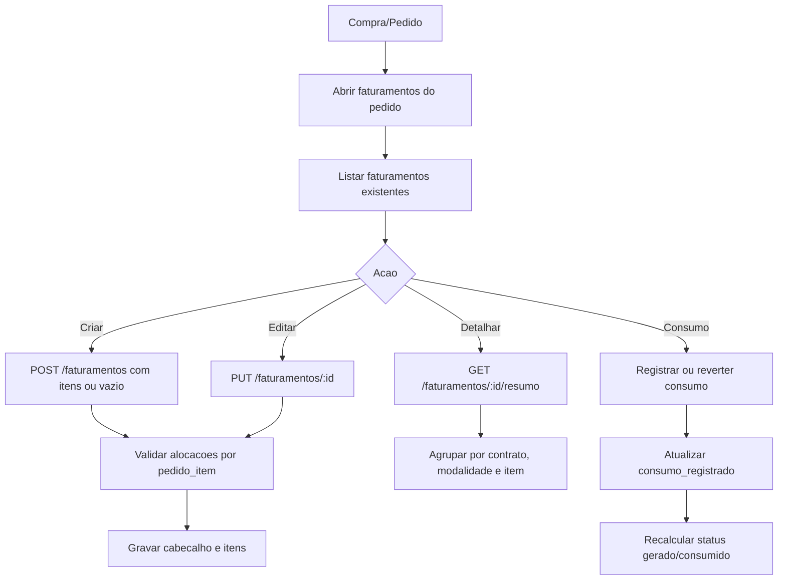

# Fluxo - Modulo Faturamento

```mermaid
flowchart TD
  A["Compra/Pedido"] --> B["Abrir faturamentos do pedido"]
  B --> C["Listar faturamentos existentes"]
  C --> D{"Acao"}
  D -->|Criar| E["POST /faturamentos com itens ou vazio"]
  D -->|Editar| F["PUT /faturamentos/:id"]
  D -->|Detalhar| G["GET /faturamentos/:id/resumo"]
  D -->|Consumo| H["Registrar ou reverter consumo"]
  E --> I["Validar alocacoes por pedido_item"]
  F --> I
  I --> J["Gravar cabecalho e itens"]
  G --> K["Agrupar por contrato, modalidade e item"]
  H --> L["Atualizar consumo_registrado"]
  L --> M["Recalcular status gerado/consumido"]
```
