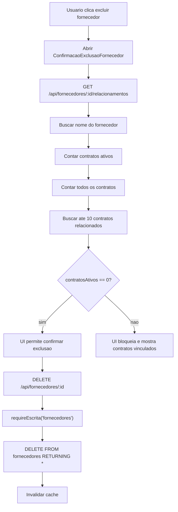

# Fluxo - Fornecedores - Exclusao

```mermaid
flowchart TD
  A["Usuario clica excluir fornecedor"] --> B["Abrir ConfirmacaoExclusaoFornecedor"]
  B --> C["GET /api/fornecedores/:id/relacionamentos"]
  C --> D["Buscar nome do fornecedor"]
  D --> E["Contar contratos ativos"]
  E --> F["Contar todos os contratos"]
  F --> G["Buscar ate 10 contratos relacionados"]
  G --> H{"contratosAtivos == 0?"}
  H -->|sim| I["UI permite confirmar exclusao"]
  H -->|nao| J["UI bloqueia e mostra contratos vinculados"]
  I --> K["DELETE /api/fornecedores/:id"]
  K --> L["requireEscrita('fornecedores')"]
  L --> M["DELETE FROM fornecedores RETURNING *"]
  M --> N["Invalidar cache"]
```
