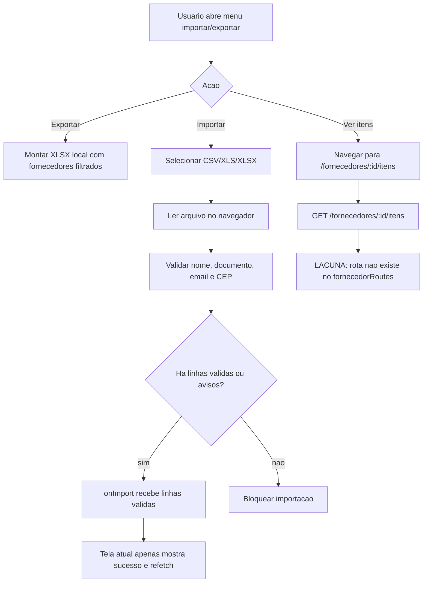

# Fluxo - Fornecedores - Importacao e Itens

```mermaid
flowchart TD
  A["Usuario abre menu importar/exportar"] --> B{"Acao"}
  B -->|Exportar| C["Montar XLSX local com fornecedores filtrados"]
  B -->|Importar| D["Selecionar CSV/XLS/XLSX"]
  D --> E["Ler arquivo no navegador"]
  E --> F["Validar nome, documento, email e CEP"]
  F --> G{"Ha linhas validas ou avisos?"}
  G -->|sim| H["onImport recebe linhas validas"]
  H --> I["Tela atual apenas mostra sucesso e refetch"]
  G -->|nao| J["Bloquear importacao"]
  B -->|Ver itens| K["Navegar para /fornecedores/:id/itens"]
  K --> L["GET /fornecedores/:id/itens"]
  L --> M["LACUNA: rota nao existe no fornecedorRoutes"]
```
