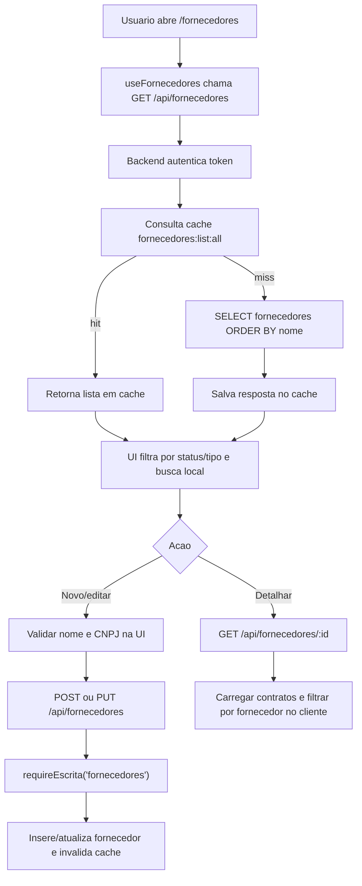

# Fluxo - Modulo Fornecedores

```mermaid
flowchart TD
  A["Usuario abre /fornecedores"] --> B["useFornecedores chama GET /api/fornecedores"]
  B --> C["Backend autentica token"]
  C --> D["Consulta cache fornecedores:list:all"]
  D -->|hit| E["Retorna lista em cache"]
  D -->|miss| F["SELECT fornecedores ORDER BY nome"]
  F --> G["Salva resposta no cache"]
  E --> H["UI filtra por status/tipo e busca local"]
  G --> H
  H --> I{"Acao"}
  I -->|Novo/editar| J["Validar nome e CNPJ na UI"]
  J --> K["POST ou PUT /api/fornecedores"]
  K --> L["requireEscrita('fornecedores')"]
  L --> M["Insere/atualiza fornecedor e invalida cache"]
  I -->|Detalhar| N["GET /api/fornecedores/:id"]
  N --> O["Carregar contratos e filtrar por fornecedor no cliente"]
```
