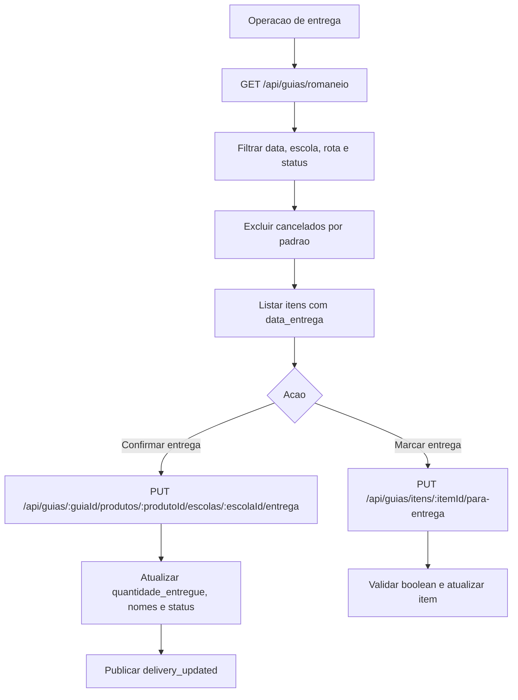

# Fluxo - Guias - Entrega e Romaneio

```mermaid
flowchart TD
  A["Operacao de entrega"] --> B["GET /api/guias/romaneio"]
  B --> C["Filtrar data, escola, rota e status"]
  C --> D["Excluir cancelados por padrao"]
  D --> E["Listar itens com data_entrega"]
  E --> F{"Acao"}
  F -->|Confirmar entrega| G["PUT /api/guias/:guiaId/produtos/:produtoId/escolas/:escolaId/entrega"]
  G --> H["Atualizar quantidade_entregue, nomes e status"]
  H --> I["Publicar delivery_updated"]
  F -->|Marcar entrega| J["PUT /api/guias/itens/:itemId/para-entrega"]
  J --> K["Validar boolean e atualizar item"]
```
